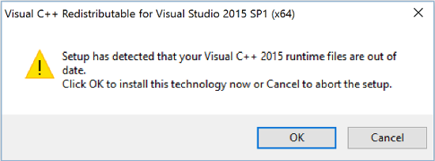
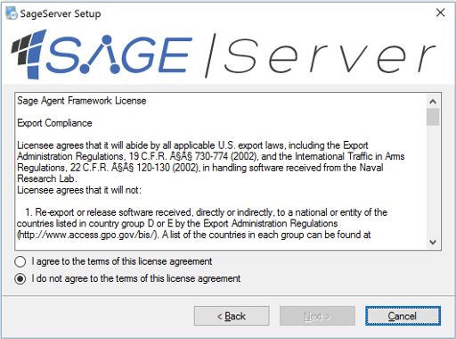
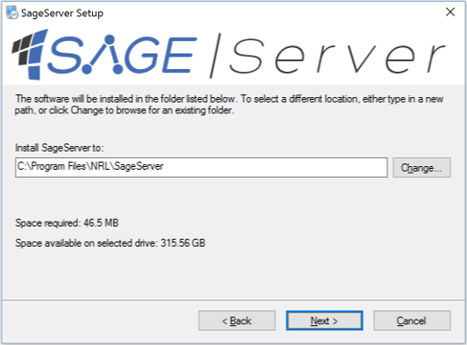
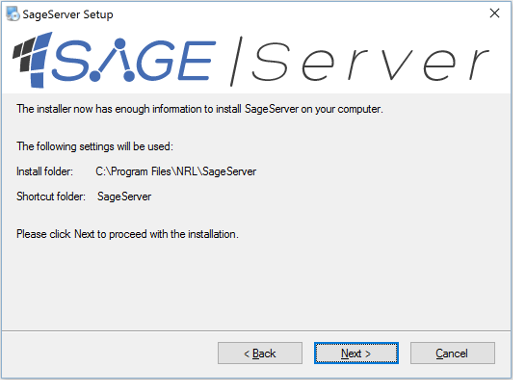
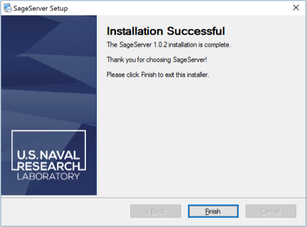

Installation
==========================

.. _requirements-label:

Requirements
---------------------------

Note that SAGE may be compatible with other versions of Windows and Linux distributions not listed below

- Windows 10, 11, Server 2016
- Red Hat Enterprise Linux 8
- Ubuntu 22

Optional for development
++++++++++++++++++++++++++++++++++++++++++++++++++++++

- `Python <https://www.python.org/downloads/>`_ 3.10
- `Java JDK <http://www.oracle.com/technetwork/java/javase/downloads/index.html>`_ 11 and up.

Windows
---------------------------

1. Start the SAGE Server or Node Installer executable
++++++++++++++++++++++++++++++++++++++++++++++++++++++

SAGE Server and Node softwares are packaged independently and include separate installers. 

After the SAGE distribution has finished downloading it should be available in your download directory. Start the SAGE Server or SAGE Node Installer executable. You may be asked to install Visuall C++ Runtime. If so, select ‘OK’ and proceeed. Select repair if needed.

Select the ‘Next’ button to continue with installing SAGE.

.. figure::  _images/sage_installer_imgs/setup_begin.png  

2. Review the SAGE license agreement 
++++++++++++++++++++++++++++++++++++++++++++++++++++++

Review the terms of agreement. To proceed, agree to the terms of the license agreement.

Select the ‘Next’ button to continue.

3. Select your installation folder 
++++++++++++++++++++++++++++++++++++++++++++++++++++++

Specify the folder where you want SAGE to be installed. The default folder will be in your Program Files directory.

Select the ‘Next’ button to continue.

4. Confirm SAGE installation
+++++++++++++++++++++++++++++++++++

Select the ‘Next’ button to begin the installation. You may get a security warning to run this file. Select ‘Yes’ to allow SAGE to proceed with installation.

5. Installation complete
+++++++++++++++++++++++++++

Once the installation is complete you can now launch SAGE.

.. _envvar-label:

Environment variables
---------------------------

The following System variables will be automatically added:

.. envvar::  SAGE_SERVER_HOME

	.. code-block:: bat
	
		C:\Program Files\NRL\SageServer

	
.. envvar::  SAGE_CLASSPATH

	.. code-block:: bat

		%SAGE_SERVER_HOME%;%SAGE_SERVER_HOME%\robotframework-4.1.2.jar;%SAGE_SERVER_HOME%\SageRemoteInterface.jar;%SAGE_SERVER_HOME%\SageJavaBehaviorInterface.jar

.. envvar::  SAGE_NODE_HOME

	.. code-block:: bat
	
		C:\Program Files\NRL\SageNode
		
**Update your PATH System variable**		
		
Java installation requires access to *jvm.dll* and *java.exe*.  The exact values will change depending on which release of Java you have and whether or not you have the jdk or jre.  The jdk is required for Java Behavior development, the jre is sufficient for Java Behavior execution.

.. envvar::  PATH

	.. code-block:: bat
	
		For Java JDK users: "C:\Program Files\Java\jdk-11.0.2\bin;C:\Program Files\Java\jdk-11.0.2\jre\bin\server"

Python requires access to *python.exe*.  The exact folder may be different on your system.

	.. code-block:: bat
				
		For Python users: "C:\Program Files\Python310"
	
		

.. _linux-install:

Installation on Linux
-----------------------------

On a terminal enter the following command, assuming the current sage distribution packages are in the local folder:

.. code-block:: bat

	sudo rpm -Uvh nrl-sage-node-*.rpm

or

.. code-block:: bat

	sudo dpkg -i nrl-sage-node-*.deb

Note that the SDK package is optional and needed only for C++ behavior development. Java and Python Behaviors can be developed without it. Note that the Linux Server is still considered to be an experimental version. To install the SDK and Server:

.. code-block:: bat

	sudo rpm -Uvh nrl-sage-sdk-*.rpm
	sudo rpm -Uvh nrl-sage-server-*.rpm

or

.. code-block:: bat

	sudo dpkg -i nrl-sage-sdk-*.deb
	sudo dpkg -i nrl-sage-server-*.deb

**Environment variables**	

SAGE Node needs the Java JVM dynamic library to be in the runtime library search path. This is accomplished by including its location in the ``LD_LIBRARY_PATH`` environment variable. This is typically done by including the definition in .bashrc file or .profile file. 

It can also be temporarily set using the same command, typically:

.. envvar::  LD_LIBRARY_PATH

	.. code-block:: bat

		export LD_LIBRARY_PATH=$LD_LIBRARY_PATH:{JRE_HOME}/lib/amd64/server
		

