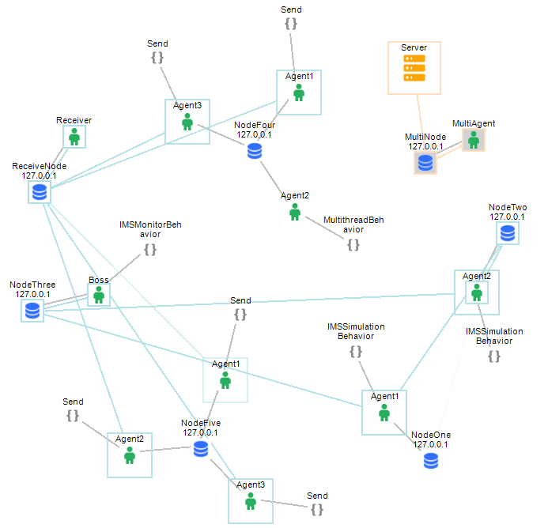

Introduction 
==================================

Sentry AGEnts (SAGE) is a multi-agent software framework that provides a platform for exploring, developing, and deploying agent-based software systems. We designed SAGE as a foundational infrastructure that can be used to find novel ways to solve problems across a wide range of applications. For example, SAGE is being used to automate the test and validation of highly complex Service Oriented Architecture systems-of-systems, to explore autonomous control of swarms of unmanned systems that must operate in disconnected network environments, to monitor the performance of deployed machine learning (ML) systems to measure model drift, and to explore the use of emergent configurations (EC) of agents that make use of IoT systems to achieve a goal. 
SAGE maintains a small footprint; it is implemented in C++ and uses an extremely efficient, and widely used interprocess communication capability, Remote Call Framework, for agent interaction, (See https://www.deltavsoft.com). 

The design of SAGE was influenced by `Herbert Simon's`_ ideas on the architecture of complexity. SAGE inherently supports the idea of emergent configurations through dynamical agent composition by other agents. The basic premise is to manage complexity through intelligent, agent driven task decomposition. An agent can reason about the components needed to perform a task. That agent composes new agents capable of performing each sub-task, and deployes them to do their work. Applying this approach recursively, a pyramidal structure of agents forms, where the leaf agents perform tasks and report results to their parent agent. Once the process completes, the agent at the apex of the pyramid receives the results of the task execution. 

.. _`Herbert Simon's`: https://en.wikipedia.org/wiki/Herbert_A._Simon

While SAGE adheres to proper agent semantics, it was designed to be pragmatic so that it can easily integrate into new or existing software systems and infrastructure. SAGE provides interface libraries that allow external systems to build, control, and interact with SAGE agent networks. SAGE agents can also interact with their surrounding environment in a number of ways: they can make use of XaaS services to gather data or extend their capabilities, they can interact directly with other software systems via their interfaces, or they can interact with hardware systems through I/O ports or memory manipulation. 

SAGE is free software and has no dependencies that require paid licenses or impose restrictions on distribution. SAGE is an open, containerized system that can run on a wide range of platforms ranging from servers to IoT devices. To support experimentation, SAGE includes an interactive agent development environment called SAGE Server App where you can interactively build, experiment with, visualize, and store agent networks.

|
SAGE is simple to use and consists of four parts:

	**SAGE Server** is a console appication available for both Windows and Linux. SAGE Server acts as the hub of a SAGE agent nework. It interacts with other SAGE components to provide them with services, manage communications, maintain system state, log system events, and provide introspection services. 

	**SAGE Node** is also a console application available for both Windows and Linux. SAGE Node acts as a container for SAGE agents, managing their execution and maintining connectivity to the SAGE Server. SAGE Node is designed to be portable across a wide variety of system architectures. Multiple instances of SAGE Node can be distributed across a network of computing devices of various architectures. SAGE Framework manages the data translation between different architectures trasparently. 

	**SAGE Agents** are automous agents consisting of a repitoir of Behaviors and a state. SAGE agents exist within a SAGE Node and can communicate with other agents using message passing. Agents can have any number of Behaviors each consisting of a mix of C++, Java, or Python modules. Behaviors are stored in a centeral repository on the SAGE Server and are sent to agents at runtime on demand. 

	**SAGE Behaviors** are objects that are derived from base classes provided with the SAGE Framework. A SAGE behavior endows an Agent with the capability to act either proactivily or reactively.