**SAGE Server Application**
===========================

The SAGE Server App provides a graphical user interface for viewing and
controlling the SAGE runtime environment. SAGE Server App supports the
following functions:

-  Manage behavior modules

-  Start and stop the SAGE server

-  View connected nodes

-  Manage nodes on the local server machine and networked remote
   machines

-  Control node access to the server machine

-  Send files and messages to nodes

-  Create, activate, deactivate and remove agents

-  Send messages to agents

-  Add and remove agent behaviors

-  Select, sequence and run SAGE Robot files

-  View generated Robot reports

-  View SAGE server log output, including behavior execution results

-  Load and Save SAGE networks

SAGE Server App is Windows compatible and distributed with the Windows
x64 - Server installer.

To run SAGE Server App, double-click on the shortcut icon, or
right-click on the icon and select “Open” from the context menu.

**Main Window**
===============

Following is an annotated view of the SAGE Server App window when the
application opens.

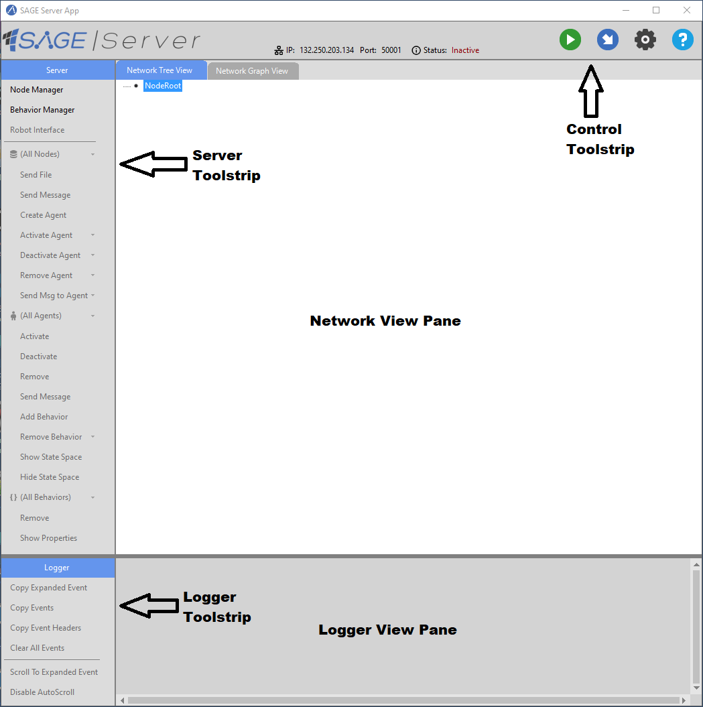

Control Toolstrip

Provides buttons for:

-  Starting and stopping the SAGE Server.

-  Loading and Saving a SAGE network.

-  Configuring Server settings.

-  Displaying information about the SAGE Server and App.

Server Toolstrip

Provides buttons for viewing and controlling the SAGE network:

-  Manage SAGE Nodes on the local Server machine and networked remote
   machines.

-  Manage SAGE Behaviors

-  Launch the SAGE Robot Interface

-  Create and remove Agents

-  Activate and deactivate Agents.

-  Add and remove Behaviors

-  View Behavior properties.

-  Send files to Nodes.

-  Send messages to Nodes and Agents.

-  View Agent State Space

Network View Pane

Allows you to view and control the SAGE network using the following
views:

-  Network Tree View

-  Network Graph View

Views can be toggled by clicking on the respective tab.

Logger Toolstrip

Allows you to interact with server-generated log events.

Provides buttons for:

-  Copying event logs to the Windows clipboard.

-  Clearing logs displayed in the Logger View Pane.

-  Controlling the scrolling of log events when the server is active.

Logger View Pane

Allows you to view server-generated log events, including behavior
execution results as they occur in real-time.

**Server Settings**
===================

Clicking on the Settings button in the Control Toolstrip brings up the
Server Settings popup dialog.

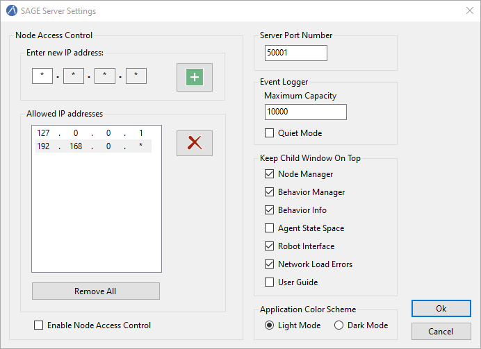

SAGE Server settings include the following:

-  Control Node access to the server machine.

-  Set Server IP port number

-  Set the maximum capacity of the SAGE event logger.

-  Adjusting window overlays.

-  Changing color theme of application.

Node access control is enforced when Enable Node Access Control is
checked. This allows you to whitelist IP addresses in dot-decimal
notation. An asterisk may be used as a wildcard character for any of the
octet-grouped decimal numbers. Only IP addresses listed are allowed to
connect to the server.

Setting the maximum capacity of the event logger prevents
Server-generated log events from overrunning memory when the Server runs
for very long periods of time (day or even weeks). When the maximum
capacity is reached, older events are removed to make room for new
events.

Settings are automatically saved when the application terminates.

**Network Tree View**
=====================

The Network Tree View provides a tree view of the SAGE network when the
Server is active.

-  The root of the network tree is the NodeRoot tree-node representing
   the set of all connected SAGE Nodes.

-  SAGE Nodes are shown as branches under the NodeRoot tree-node. Each
   Node has an Agents tree-node representing the set of all Agents
   belonging to the Node.

-  A Node’s Agents are shown as branches under the Agents tree-node.
   Each Agent has a Behaviors tree-node representing the set of all
   Behaviors belonging to the Agent.

-  An Agent’s Behaviors are shown as leaf tree-nodes under the Behaviors
   tree-node.

Clicking on any tree-node selects and highlights it. Tree-nodes
representing ancestor network entities are also selected.

Right-clicking on a tree-node displays a set of cascading context menus
with a set of commands relevant to the current selection.

You can expand and collapse tree-nodes by clicking on the plus or minus
sign next to a tree-node branch.

Double-clicking on a tree-node fully expands a branch if it is
collapsed, and fully collapses a branch if it is expanded.

.. image:: _images/serverapp/image3.png
   :width: 6.5in
   :height: 5.92569in

**Network Graph View**
======================

The Network Graph View provides a dynamic graph display of the SAGE
network when the Server is active.

-  The Server graph-node represents the SAGE Server and is always
   visible when the Server is active.

-  SAGE Nodes are shown as root graph-nodes of their own sub-graphs.

-  Graph-nodes representing Agents are connected to their Node
   graph-node, and graph-nodes representing Behaviors are connected to
   their Agent graph-node.

Clicking on any graph-node selects and highlights it. Graph-nodes
representing ancestor network entities are also selected.

Right-clicking on a graph-node displays a set of cascading context menus
with a set of commands relevant to the selected object.

Clicking on the Server graph-node or on the view background displays a
context menu relevant to the entire network.

You can reposition entities within the graph region by dragging with the
left mouse button.

Double-clicking on a graph-node centers the entity within the view pane.

Double-clicking on the view background centers the graph region about
that position in the view pane.

The graph view can be panned by clicking down anywhere in the view pane
that is not on a graph-node and dragging.

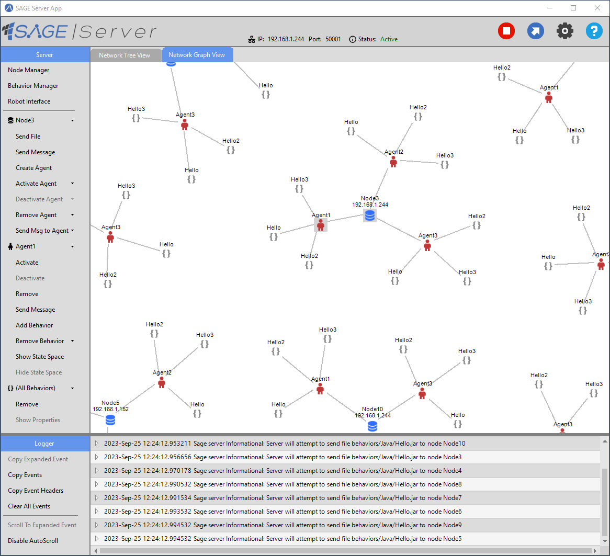

The graph view can be zoomed out and back in using the mouse wheel. When
zooming, the scaling is applied about the mouse cursor position.

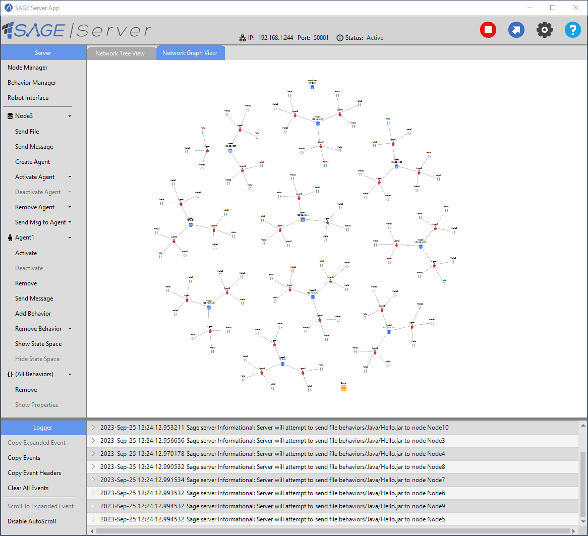

**Starting the Server**
=======================

Click the Start button or the Load Network button in the Control
Toolstrip to start the Server instance. After the Server has started,
any previously created Nodes will be connected and displayed in the
Network View Pane.

If the Server is started using the Load Network button, a previously
saved Agent network is loaded. Nodes specified in the Agent network
which are not already running will be started.

Once the Server becomes active, the Start button changes to a Stop
button and the Load Network button changes to a Save Network button. The
Server can be stopped at any time by clicking the Stop button.

**Active Server**
=================

When the Server is active, the current state of the network is reflected
in the Server Toolstrip and the Network View Pane.

The following screenshot shows an active Server network, with the
Network Tree View displayed in the view pane. |image1|

Clicking on the Network Graph View tab displays a graph-based view of
the network.

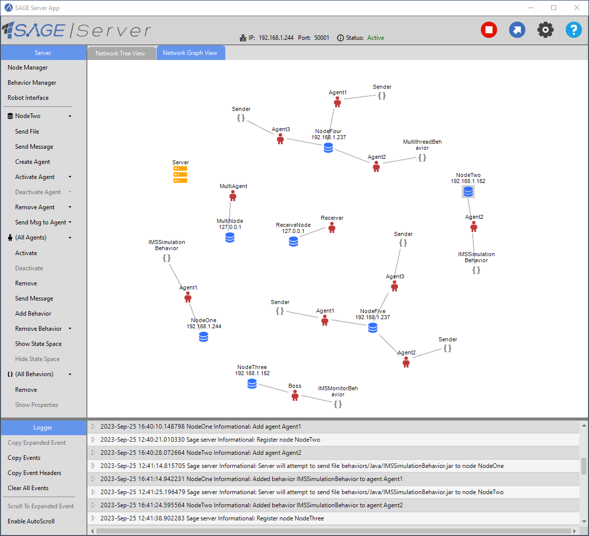

Nodes, their Agents and agent Behaviors are selected using either the
ServerToolstrip or Network View Pane.

Commands operate on the current selection and are accessible from either
the Server Toolstrip or Network View Pane context menus.

On the Server Toolstrip, node-related commands are under the Node
dropdown button, agent-related commands are under the Agent dropdown
button, and behavior-related commands are under the Behavior dropdown
button.

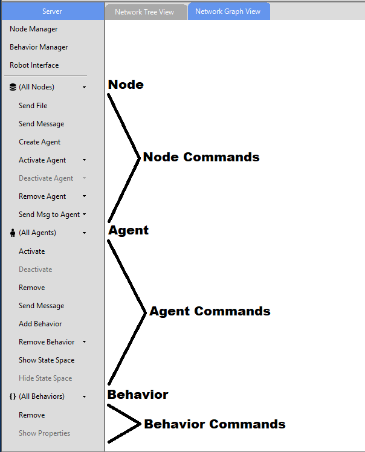

When an individual Node, Agent or Behavior is not selected, the
corresponding dropdown button will display “(All Nodes)”, “(All
Agents)”, or “(All Behaviors)”, and the commands will apply to all
objects of that type.

In the image above, clicking the agent Activate button on the Server
Toolstrip activates all inactive agents on all nodes in the network.

The image below shows how to perform the same operation using the
Network View Pane:

1. Right-click on one of the following to display the Network View Pane
   context menu:

-  NodeRoot in the Network Tree View.

-  The Server graph-node in the Network Graph View.

-  The panel background in the Network Graph View.

2. Move the mouse over (All Nodes) to display the cascading node context
   menu.

3. Move the mouse over (All Agents) to display the cascading agent
   context menu.

4. Click the Activate button on the agent context menu.

|image2|\ |image3|

Notice that commands in the cascading context menus match the commands
in the Server Toolstrip.

In the Network Graph View, icons representing the newly activated Agents
change color from red (inactive) to green (active), and dynamic
messaging lines show the flow of messages sent between Agents.

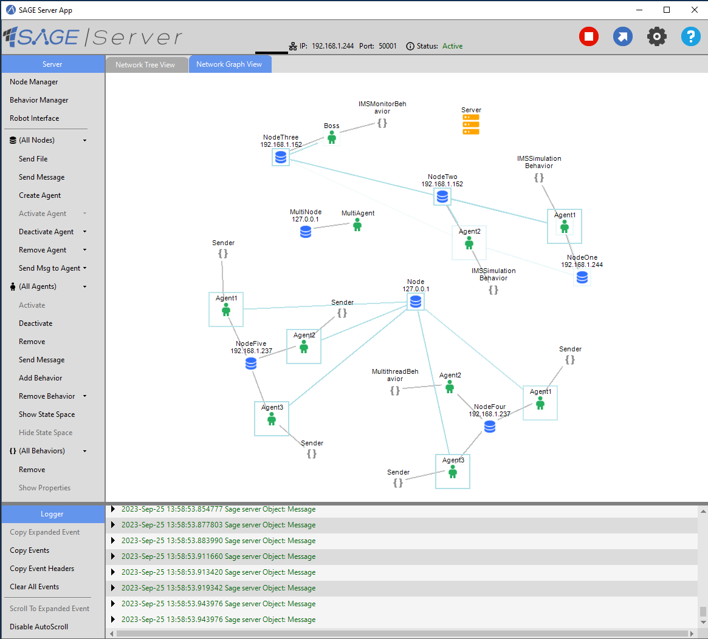

Click on the agent Deactivate button to deactivate all the Agents.

**Selecting a SAGE Node, Agent or Behavior**

A SAGE object (Node, Agent or Behavior) can be selected from the Server
Toolstrip or the Network View Pane.

To select a Node, Agent or Behavior from the Network View Pane, click on
the corresponding tree-node or graph-node.

To select a Node, Agent or Behavior from the Server Toolstrip, click on
the corresponding dropdown button and select the object’s name from the
popup combo box, as shown below.

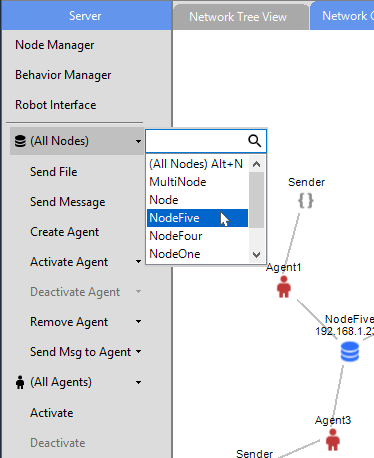

The current selection is reflected in both the Server Toolstrip and
Network View Pane (Tree View or Graph View).

The mechanism for selecting SAGE objects and applying commands is
enforced by the topology of the Network Tree View and Graph View and by
the Server Toolstrip menu items.

In the screen shot below, NodeFive is selected, but no Agent or Behavior
has been selected.

-  The node-related commands apply to NodeFive.

-  The agent-related commands apply to all the NodeFive Agents.

-  The behavior-related commands apply to all the Behaviors on all the
   NodeFive Agents.

|image4|\ |image5|

The Server Toolstrip can be very useful when managing networks with a
large number of Nodes or Agents.

In the following screenshot, the network has a single Node with 50
Agents. Selecting an Agent using the Server Toolstrip is much easier
than trying to locate and select the Agent using either of the Network
Views.

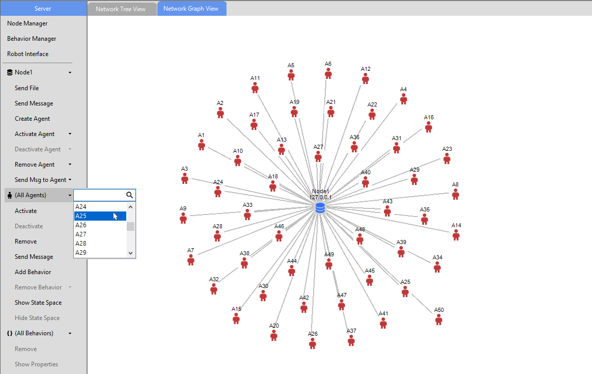

The number of Agent names to scroll through in the toolstrip combo box
can be reduced by entering the first few letters of the name (e.g. “A2”)
in the combo box edit control.

**The Node Manager**
====================

Use the SAGE Node Manager to start and stop Containerized and
NonContainerized Nodes on the Local Host computer, and containerized
nodes on networked Remote Host computers. SAGE Nodes can be started and
stopped at any time, even when the Server is inactive.

The Node Manager is opened by clicking on the Node Manager button on the
Server Toolstrip or the Network View Pane context menu (when selecting
the NodeRoot in the Tree View or the Server graph-node or panel
background in the Graph View) .

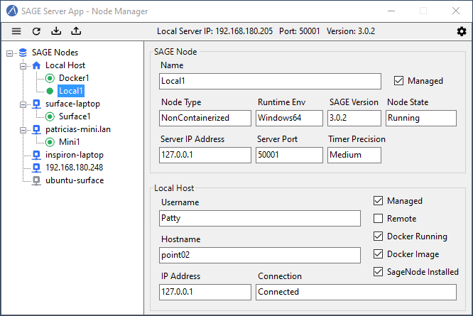

The Network Tree at the left displays the current host network (the
Local Host and any managed Remote Hosts) and the SAGE nodes running on
each Host. The Information Pane at the right displays information about
the selected Node or Host tree-node.

A Host is in the connected state if its icon is blue; a gray icon
indicates the Host is currently not connected. A Remote Host is
identified by its name if the name was supplied when the Remote Host was
added, otherwise the Remote Host is identified using its IPv4 address.

Nodes may be Containerized (running in a Docker container) or
NonContainerized (running as a process on the host computer). The icon
for Containerized Nodes is a “bulls-eye”, whereas the icon for
NonContainerized Nodes is a singe solid circle. Both Containerized and
NonContainerized Nodes may be started on the Local Host, however, only
Containerized Nodes may be started on a Remote Host.

The Node Manager displays only “Managed” Hosts and their Nodes. Managed
Hosts include the Local Host and any Remote Hosts which were added to
the Node Network by resolving their connectivity using SSH key-based
authentication. Managed Nodes include Containerized and NonContainerized
Nodes that were started by the Node Manager, as well as any
Containerized Nodes that were independently started (outside of the App)
on the Local Host or any of the currently connected Managed Remote
Hosts.

Note that a Managed Remote Host may not be in a connected state at a
given point in time, and that no Nodes will be displayed for a
disconnected Remote Host.

“Unmanaged” Nodes are Nodes which do not appear in the Node Manager
Network, but which may be connected to the active Server and displayed
in the SAGE Server App Network View Pane. These include NonContainerized
Nodes started outside of the App on the Local Host or a Remote Host, as
well as any Containerized Nodes running on an Unmanaged Remote Host.

Node Manger Settings

Clicking on the Settings button in the Node Manager menu brings up the
Node Manager Settings popup dialog.

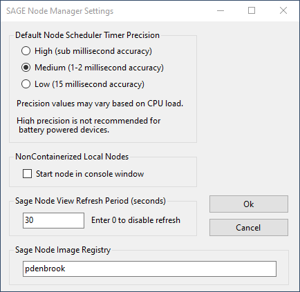

Node Manager settings include the following:

-  Default Node Scheduler Timer Precision.

-  Option to start a Local NonContainerized Node in a console window.

-  Node View Refresh Period to set the frequency for refreshing the Node
   Network.

   -  The Node Network can be refreshed manually at any time by clicking
      on the Refresh button (curved arrow icon) on the Node Manager menu
      strip.

-  Node Image Registry for pulling SAGE Docker images.

Node Manager: Adding a Remote Host

To add a Remote Host to the Node Network:

1. Select the “SAGE Nodes” tree-node.

2. Bring up the “SAGE Nodes” context menu by right-clicking on the SAGE
   Nodes tree-node or left-clicking on the Manage menu button (icon with
   three horizontal bars).

3. Click the Add Managed Remote Host command.

4. In the popup dialog, enter the Username and Host ID for logging onto
   the remote host (using previously configured SSH key-based
   authentication).

   -  The Host ID can be either the name of the remote host or its IPv4
      address.

5. Click the Test Connection button to resolve the Host ID.

6. If the connection was successful, click Ok to confirm the command, or
   Cancel to cancel the operation.

|image6|\ |image7|

In additon to the Add Managed Remote Host command, the “SAGE Nodes”
context menu also includes commands to Remove All Managed Remote Hosts
and Stop All Managed Nodes. The Node Manager always requests
confirmation before removing a Remote Host.

**
**

Node Manager: Removing a Remote Host

To remove a Remote Host from the Node Network:

1. Select the Remote Host tree-node.

2. Bring up the Remote Host context menu by right-clicking on the Remote
   Host tree-node or left-clicking on the Manage menu button.

3. Click Remove Managed Host to remove the Remote Host.

To remove all Managed Remote Hosts from the Node Network:

-  Select Remove All Managed Remote Hosts from the “SAGE Nodes” context
   menu.

The Node Manager will always request confirmation before removing a
Remote Host.

Node Manager: Pulling a Docker Image to a Host

Two conditions are required to start a Containerized Node on a Managed
Host: Docker must be installed and running, and the Docker sagenode
image for the current SAGE version (e.g., sagenode:3.0.3) must be
present on the Host. When a Host is selected in the Network Tree, the
Docker Running and Docker Image check boxes in the Information Pane
indicate if these conditions have been met. If Docker is running but the
sagenode image is missing, the Host context menu provides a command for
pulling the image from the Sage Node Image Repository specified in the
Settings dialog.

To pull a Docker sagenode image:

1. Select the Host tree-node.

2. Bring up the Host context menu by right-clicking on the Host
   tree-node or left-clicking on the Manage menu button.

3. Click Pull Image to initiate the pull operation.

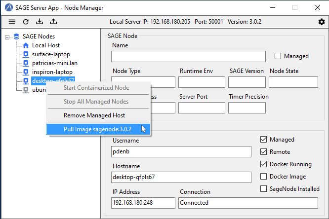

The pull operation can be lengthy, especially if this is the first time
a sagenode image has been pulled to this Host. While the pull is in
progress the Host context menu provides a means of cancelling the
operation. When the pull is complete, the pull items are removed from
the context menu and the Docker Image checkbox will be checked.

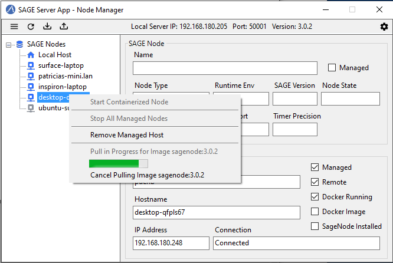

Node Manager: Starting a Node

To start a Node on the Local Host or a Remote Host:

1. Select the Host tree-node (Local Host or a Remote Host).

2. Bring up the Host context menu by right-clicking on the Host
   tree-node or left-clicking on the Manage menu button.

3. Click Start Containerized Node to start a containerized Node, or
   Start NonContainerized Node (Local Host only) to start a
   nonContainerized Node.

   -  Start Containerized Node is enabled if Docker is running and the
      required Docker sagenode image is available on the Host system.

   -  Start NonContainerized Node is available only on the Local Host
      context menu and is enabled if SAGE Node is installed on the local
      system.

4. In the popup dialog, enter the Node name and select the desired
   Scheduler Timer Precision (High, Medium or Low).

5. Click Ok to confirm the command, or Cancel to cancel the operation.

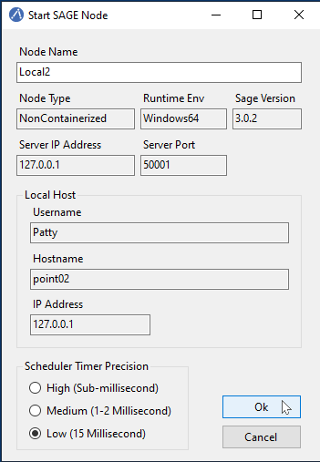

The newly created Node will appear beneath the Host tree-node in the
Network Tree. For a local nonContainerized Node, a SageNodeConsole
console window will be displayed on the desktop if that option was
enabled in the Node Manager settings.

If the Server is active, the Node will connect to the Server and be
displayed in the SAGE Server App Network View Pane. If the Server is
inactive, the Node instance will connect after the Server is started.

Node Manager: Stopping a Node

To stop a Node on the Local Host or a Remote Host:

1. Select the Node tree-node.

2. Bring up the Node context menu by right-clicking on the Node
   tree-node or left-clicking on the Manage menu button.

3. Click Stop Node to initiate Node termination.

   -  A NonContainerized Node will normally stop immediately, however, a
      Containerized Node can take a number of seconds to stop. The icon
      color changes to red to indicate that the Node is in the process
      of terminating. Upon termination, the Node is removed from the
      Node Network.

To stop all Nodes on a single Host or the entire Network:

-  Select Stop All Managed Nodes on a Host context menu to stop all
   Managed Nodes on that Host.

-  Select Stop All Managed Nodes on the “SAGE Nodes” context menu to
   stop all Managed Nodes on the Network.

**
**

**The Behavior Manager**
========================

Use the Behavior Manager to view and update installed Behaviors.

The Behavior Manager is opened by clicking on the Behavior Manager
button on the Server Toolstrip.

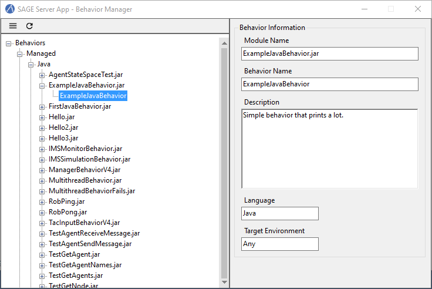

The Behavior Tree on the left shows the currently installed behavior
modules and their Behaviors.

The Behavior Information Pane on the right contains information about a
Behavior when its corresponding tree-node is selected.

Tree-nodes at the first three levels represent hierarchical colletions
of behavior module types, classified by language and target environment.

   Under Managed are the currently supported Managed Behavior Types:
   “Java”, “JavaScript” and “Python”.

   Under Native are the currently supported Native Behavior Types:
   “Linux32”, “Linux64”, “Windows32” and “Windows64” (32-bit and 64-bit
   Windows and Linux modules).

Under each Behavior Type tree-node are tree-nodes representing the
installed Behavior Modules for that type.

   The file extensions correspond to the Behavior Type, e.g., “.jar” for
   Java, “.py” or “.egg” for Python, “.so” for Linux32 and Linux64, and
   “.dll” for Windows32 and Windows64.

Under each Behavior Module tree-node is the leaf tree-node representing
that module’s Behavior. When a Behavior tree-node is selected,
information about that Behavior is displayed in the Behavior Information
Pane.

Management capabilities include adding and deleting Behavior Modules,
and refreshing the Behavior Tree to synchronize the Behavior Tree with
the SAGE Behavior repository.

Behavior Manager: Adding a Behavior module

To add a Behavior Module from the respoitory:

1. Select an appropriate tree-node from one of the first three levels
   (Behaviors, Managed, Native, or one of the Behavior Types).

   -  Selecting a lower-level tree node restricts the types of modules
      to add, e.g., selecting the Java Behavior Type will only allow
      adding Java Behavior Modules.

2. Bring up the associated context menu by right-clicking on the
   selected tree-node or left-clicking on the Manage menu button (icon
   with three horizontal lines).

3. Click Add Module to display a File Open dialog. Navigate to the
   desired folder and select one or more Behavior Module files to open.

When a Behavior Module is added, the file is automatically added to the
proper SAGE Behavior repository sub-directory.

+-----------------+----------------------------------------------------+
| Behavior Type   | Behavior Path                                      |
+=================+====================================================+
| Java            | C:\\ProgramData\\Sage\\behaviors\\Java             |
+-----------------+----------------------------------------------------+
| JavaScript      | C:\\ProgramData\\Sage\\behaviors\\JavaScript       |
+-----------------+----------------------------------------------------+
| Python          | C:\\ProgramData\\Sage\\behaviors\\Python           |
+-----------------+----------------------------------------------------+
| Windows32       | C:\\ProgramData\\Sage\\behaviors\\Windows32        |
+-----------------+----------------------------------------------------+
| Windows64       | C:\\ProgramData\\Sage\\behaviors\\Windows64        |
+-----------------+----------------------------------------------------+
| Linux32         | C:\\ProgramData\\Sage\\behaviors\\Linux32          |
+-----------------+----------------------------------------------------+
| Linux64         | C:\\ProgramData\\Sage\\behaviors\\Linux64          |
+-----------------+----------------------------------------------------+

Behavior Manager: Removing a Behavior module

To remove a Behavior Module from the respoitory:

1. Select the Behavior Module tree-node.

2. Bring up the Behavior Module context menu by right-clicking on the
   selected tree-node or left-clicking on the Manage menu button.

3. Click Delete Module to remove the Behavior Module file from the SAGE
   Behavior repository.

   -  The Node Manager will request confirmation before completing the
      action.

Behavior Manager: Refreshing the Behavior Tree

Click the Refresh Behavior Tree menu button (circular arrow icon) to
synchronize the behavior tree with the SAGE Behavior repository. This is
only required when behaviors are installed or uninstalled from the
repository outside of the App while the Behavior Manager window is open.

The Behavior Tree is automatically refreshed whenever the Behavior
Manager is opened.

The Behavior Manager is available when the Server is both active and
inactive and can remain open while the user interacts with the App’s
main form window.

 **Creating an Agent**
======================

Agents can be created on Nodes when the Server is active.

To create an Agent on one or more Nodes:

1. Select the Node(s) from the Server Toolstrip or Network View Pane.

   -  Select a Node to create the Agent on just that Node.

   -  Select (All Nodes) to create the Agent on all SAGE nodes.

2. Click Create Agent from the Server Toolstrip or the Network View Pane
   context menu.

3. Enter the Agent’s name in the popup dialog.

4. Click Ok to confirm the command, or Cancel to cancel the operation.

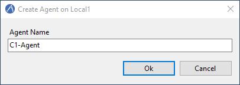

If the agent already exists on a Node, the agent will not be created on
that Node.

**Adding a Behavior to an Agent**
=================================

Behaviors can be added to Agents when the Server is active.

To add a Behavior to one or more Agents:

1. Select the Agent(s) from the Server Toolstrip or Network View Pane.

   -  Select an Agent to add the Behavior to just that Agent.

   -  Select a Node to add the Behavior to all Agents of that Node.

   -  Select (All Nodes) to add the Behavior to all Agents of all the
      Nodes.

2. Click Add Behavior from the Server Toolstrip or the Network View Pane
   context menu.

3. Select the Behavior from the Behavior Tree.

4. Click Ok to confirm or Cancel to cancel the operation.

   -  You can also confirm by right-clicking the Behavior and selecting
      Select Behavior.

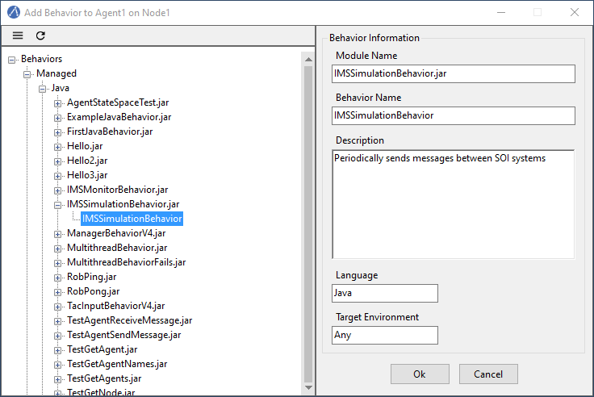

If confirmed, the following popup dialog will appear:

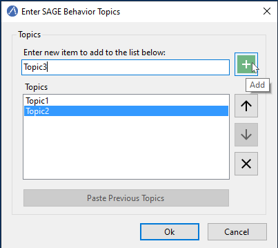

To specify topics for the Behavior:

1. Enter the desired behavior topic strings. If topics have been added
   to a previous Behavior, button Paste Previous Topics will be enabled.
   Clicking this button will automatically add the previous topics to
   this behavior.

2. Click Ok to continue or Cancel to continue without adding a topic.

If the behavior already belongs to an Agent, the behavior will not be
added to that Agent.

**Viewing Behavior Properties**
===============================

To view the properties of a Behavior:

1. Select the Behavior from the Server Toolstrip or the Network View
   Pane.

2. Click Show Properties from the Server Toolstrip or the Network View
   Pane context menu.

The Behavior Properties include the information provided by the Behavior
Manager as well as any Behavior Topics assigned when the Behavior was
added to the Agent.

The Behavior Properties windows remains visible until the user closes it
or the Behavior becomes unselected in the Server Toolstrip or Network
View Pane.

**
**

**Removing a Behavior from an Agent**
=====================================

Behaviors can be removed from Agents when the Server is active.

To remove one or more Behaviors using the Remove command:

1. Select the Behavior(s) from the Server Toolstrip or the Network View
   Pane.

   -  Select the Behavior to remove just that Behavior.

   -  Select an Agent to remove all Behaviors from the Agent.

   -  Select a Node to remove all Behaviors from all Agents of the Node.

   -  Select (All Nodes) to remove all Behavior from all Agents of all
      the Nodes.

2. Click Remove from the Server Toolstrip or the Network View Pane
   context menu.

To remove one or more instances of a named Behavior using the Remove
Behavior command:

1. Select the Agent(s) having the named Behavior from the Server
   Toolstrip or the Network View Pane.

   -  Select an Agent which has the named Behavior.

   -  Select a Node having at least one Agent which has the named
      Behavior.

   -  Select (All Nodes) -- assumes a Network having at least one Agent
      which has the named Behavior.

2. Click Remove Behavior from the Server Toolstrip or the Network View
   Pane context menu, then select the Behavior name from the popup combo
   box.

**Activating an Agent**
=======================

Inactive agents can be activated when the Server is active.

To activate one or more Agents using the Activate command:

1. Select the Agent(s) from the Server Toolstrip or the Network View
   Pane.

   -  Select the Agent to activate just that Agent.

   -  Select a Node to activate all Agents of that Node.

   -  Select (All Nodes) to activate all Agents of all the Nodes.

2. Click Activate from the Server Toolstrip or the Network View Pane
   context menu.

To activate one or more instances of a named Agent using the Activate
Agent command:

1. Select the Node(s) having the named Agent from the Server Toolstrip
   or the Network View Pane.

   -  Select a Node which has the named Agent.

   -  Select (All Nodes) -- assumes a Network having at least one Node
      which has the named Agent.

2. Click Activate Agent from the Server Toolstrip or the Network View
   Pane context menu, then select the Agent name from the popup combo
   box.

**Deactivating an Agent**
=========================

Active agents can be deactivated when the Server is active.

To deactivate one or more Agents using the Deactivate command:

1. Select the Agent(s) from the Server Toolstrip or the Network View
   Pane.

   -  Select the Agent to deactivate just that Agent.

   -  Select a Node to deactivate all Agents of that Node.

   -  Select (All Nodes) to deactivate all Agents of all the Nodes.

2. Click Deactivate from the Server Toolstrip or the Network View Pane
   context menu.

To deactivate one or more instances of a named Agent using the
Deactivate Agent command:

1. Select the Node(s) having the named Agent from the Server Toolstrip
   or the Network View Pane.

   -  Select a Node which has the named Agent.

   -  Select (All Nodes) -- assumes a Network havnig at least one Node
      which has the named Agent.

2. Click Deactivate Agent from the Server Toolstrip or the Network View
   Pane context menu, then select the Agent name from the popup combo
   box.

**Sending a Message**
=====================

The Send Message command allows the user to send a message from the SAGE
server to one or more Nodes and their Agents when the Server is active.

To send a message:

1. Select the target Node(s) and Agents(s) from the Server Toolstrip or
   the Network View Pane.

   -  Select an Agent to send a message to just the Agent and its Node.

   -  Select a Node to send a message to the Node and all its Agents.

   -  Select (All Nodes) to send a message to all the Nodes and all
      their Agents.

2. Click Send Message from the Server Toolstrip or the Network View Pane
   context menu.

3. In the Send Message dialog, enter the message text, topic and any
   data items.

4. Click Ok to confirm, or Cancel to cancel the operation.

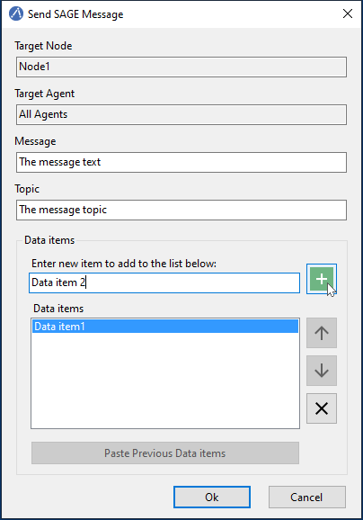

Message sending is graphically depicted in the Network Graph View.
Messages are shown traveling from the source (in this case the Server)
to one or more destinations (in this case Node1 and all its Agents).

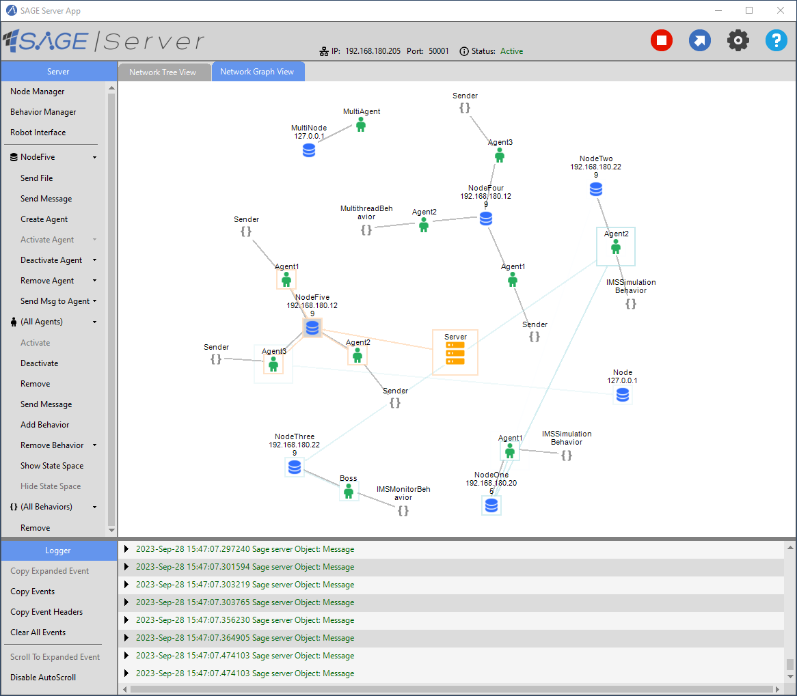

The source entity is highlighted with a large rectangle and the
destination entity are highlighted with small rectangles.

Server messages (generated using the Send Message command) are shown in
orange.

Agent messages (generated by agent Behaviors) are shown in light blue.

**
**

**Sending Files to a Node**
===========================

The Send File command allows the user to send a file from the SAGE
server to one or more Nodes when the Server is active.

To send a file:

1. Select the Node(s) from the Server Toolstrip or the Network View
   Pane.

   -  Select a Node to send the file to just that Node.

   -  Select (All Nodes) to send a file to all the Nodes.

2. Click Send File from the Server Toolstrip or the Network View Pane
   context menu.

3. Navigate to the desired folder and select the file to send.

4. Click Open to confirm, or Cancel to cancel the operation.

A sub-folder with the same name as the Node will be created (if it does
not already exist) in the SAGE data directory on the targeted Node
machine where the sent files will be copied to.

“\ *C:\\ProgramData\\Sage\\data\\NodeName”*

**Viewing Agent State Spaces**
==============================

Every SAGE agent has a State Space which includes the following
information:

-  Agent name

-  Node name

-  The “sageHome” directory

-  The “sageNodeHome” directory

An active Agent can have additional named States which are created and
managed by one or more of its Behaviors.

To view the State Space for one or more Agents:

1. Select the Agent(s) from the Server Toolstrip or Network View Pane.

   -  Select an Agent to view its State Space.

   -  Select a Node to display the State Spaces of all Agents on the
      Node.

   -  Select (All Nodes) to display the State Spaces of all Agents on
      all SAGE nodes.

2. Click Show State Space from the Server Toolstrip or the Network View
   Pane context menu.

   -  If the State Space is already open, this will bring it to the
      foreground.

The Agent State Space below shows a number of additional states which
were created and are dynamically managed by the Agent’s Behavior.

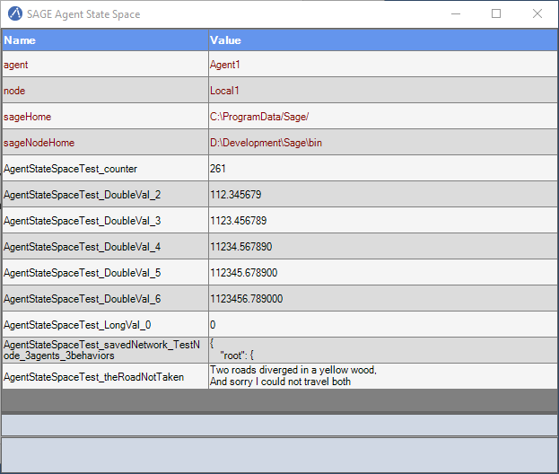

To hide open Agent State Space(s), either click the State Space window’s
Close button or do the following:

1. Select the Agent(s) from the Server Toolstrip or Network View Pane.

   -  Select an Agent to hide its State Space.

   -  Select a Node to hide the State Spaces of all Agents on the Node.

   -  Select (All Nodes) to hide the State Spaces of all Agents on all
      SAGE nodes in the foreground.

2. Click Hide State Space from the Server Toolstrip or the Network View
   Pane context menu.

**The SAGE Robot Interface**
============================

The SAGE Robot Interface allows you to run Robot scripts and view the
results from within the SAGE Server App.

Click the Robot Interface button on the Server Toolstrip to start a new
instance of the SAGE Robot Interface, as shown below.

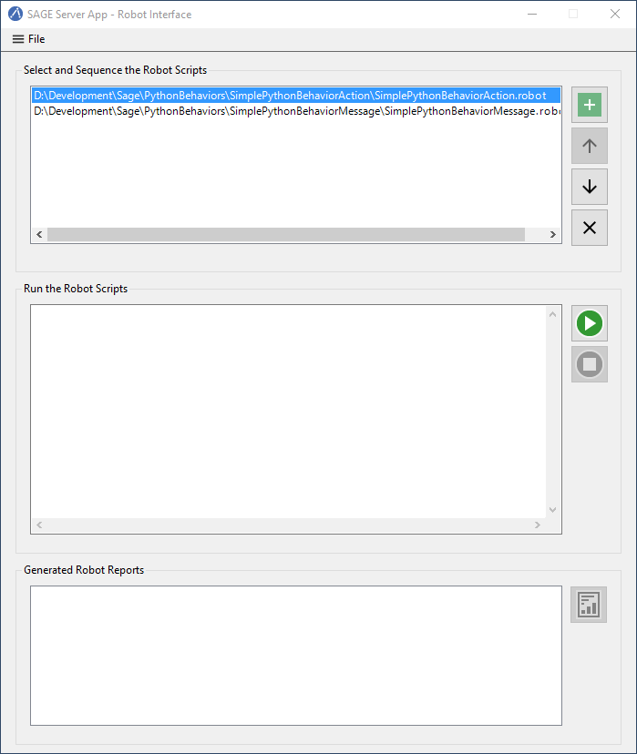

At the top of the window are controls to select and sequence the Robot
script files.

Robot scripts are added, removed and sequenced using the buttons to the
right of the Robot scripts list.

The Add and Remove operations are also available from the File menu.

To run a Robot script:

1. Open Robot Interface

2. Click the Add button .

3. Select the Robot file and click Open.

4. Repeat steps 1 and 2 to add additional Robot scripts.

5. Click the Start button to start the run.

The Robot scripts will be run one at a time in the sequence specified.

Clicking the Stop button will abort the run.

When a Robot script successfully completes, the pathname of the
generated report file appears in the report list at the bottom of the
window.

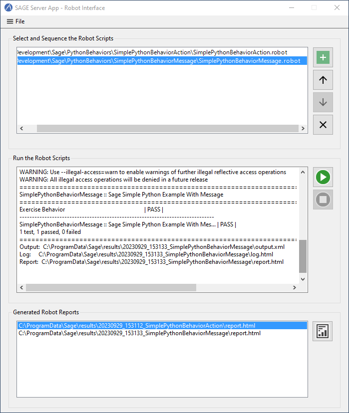

To view a report, select it from the report list and click the Report
button located in the bottom-right corner. You may also right-click the
report pathname and select View Report from the context menu.

**The Log Viewer**
==================

The display of Server-generated log events are handled by the Log
Viewer.

The types of log events include exceptions, errors, warning,
informational messages, and behavior execution results.

By default a single-line header is displayed showing the timestamp,
event type, and a brief description.

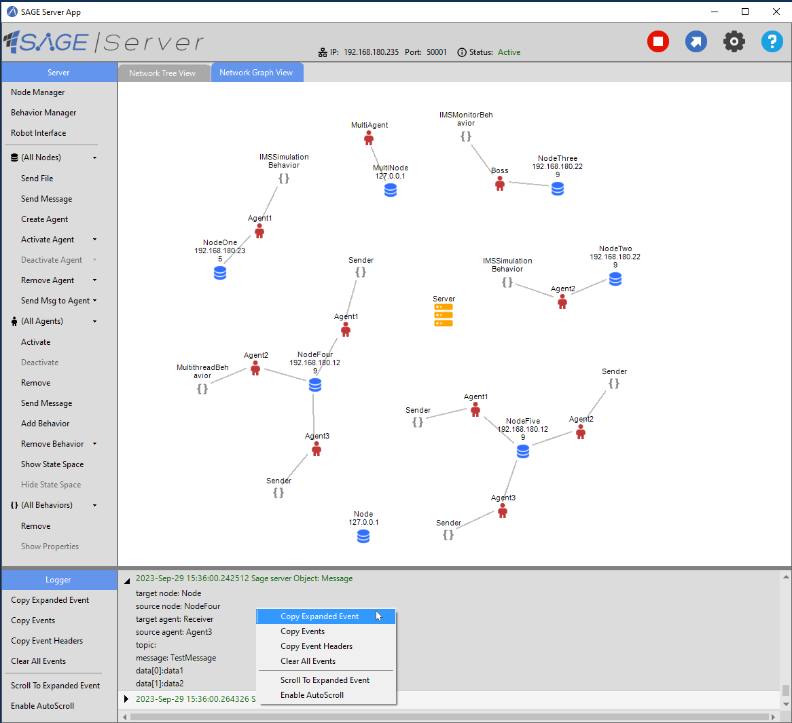

Message and result events can be expanded to show additional
information.

Only one log event can be expanded at a time.

The Logger Toolstrip provides buttons for copying log events to the
Windows clipboard and for clearing the Log Viewer. These commands are
also available on the context menu displayed when right-clicking on a
log event.

When the Server is stopped, currently displayed event logs remain.

All events, including removed events, are saved to a log data file
located in *C:\\ProgramData\\SAGE\\logs*.

**Loading and Saving an Agent Network**
=======================================

Agent network configurations can be saved and loaded. The files are
saved as two JSON files with a common base filename and the extensions
“.sage” and “.sagenode”.

-  The Node Network JSON file has extension “.sagenode” and is used by
   the SAGE Node Manager to start the Managed Nodes.

   -  Node networks can be independently loaded and saved from the Node
      Manager using the Load Managed Nodes and Save Managed Nodes
      menu buttons, even when the Server is inactive.

-  The Agent Network JSON file has extension “.sage” is used by the SAGE
   Server to load the Agents and their Behaviors on the connected Nodes.

   -  This is the file that the user sees when loading or saving an
      Agent Network from the App. It will always be accompanied by
      the companion “.sagenode” file used by the Node Manager to
      start the Nodes.

**Saving an Agent Network**

The current Agent network configuration can be saved (exported) when the
Server is active.

To save an Agent network:

1. Click the Save Network button on the Control Toolstrip.

2. Navigate to the desired folder for saving the network configuration
   files.

3. Enter a filename for your Agent Network configuration (must have
   extension “.sage”).

4. Click the Save button.

**Loading an Agent Network**

A previously saved network configuration can be loaded (imported) when
the Server is inactive.

To load an Agent network:

1. Click the Load Network button on the Control Toolstrip.

2. Navigate to the folder containing the previously saved network
   configuration files and select the Agent Network file (with extension
   “.sage”).

3. Click the Open button.

The SAGE Server will start and the Node Manager will attempt to start
any missing Nodes. The Server will then perform a validation check on
the JSON tree by ensuring that all Nodes referenced in the network exist
and that all Behaviors to be added to the Agents exists in the Behavior
repository.

If there are any errors (e.g., missing Nodes or Behaviors), an “Agent
Network Load Errors” dialog window will appear listing the errors.

The dialog window remains open while the user attempts to resolve the
issues.

.. image:: _images/serverapp/image33.png
   :width: 6.5in
   :height: 5.67431in

In the above example, two Nodes residing on the remote Host named
“surface-laptop” could not be started because the remote Host was
offline. The issue is resolved by bringing “surface-laptop” back online.

Click the Retry button to retry loading the network configuration, or
click Cancel to abort the operation.

If there are no more errors, the Server is able to create the Agents and
load their Behaviors so that the saved network is fully configured.

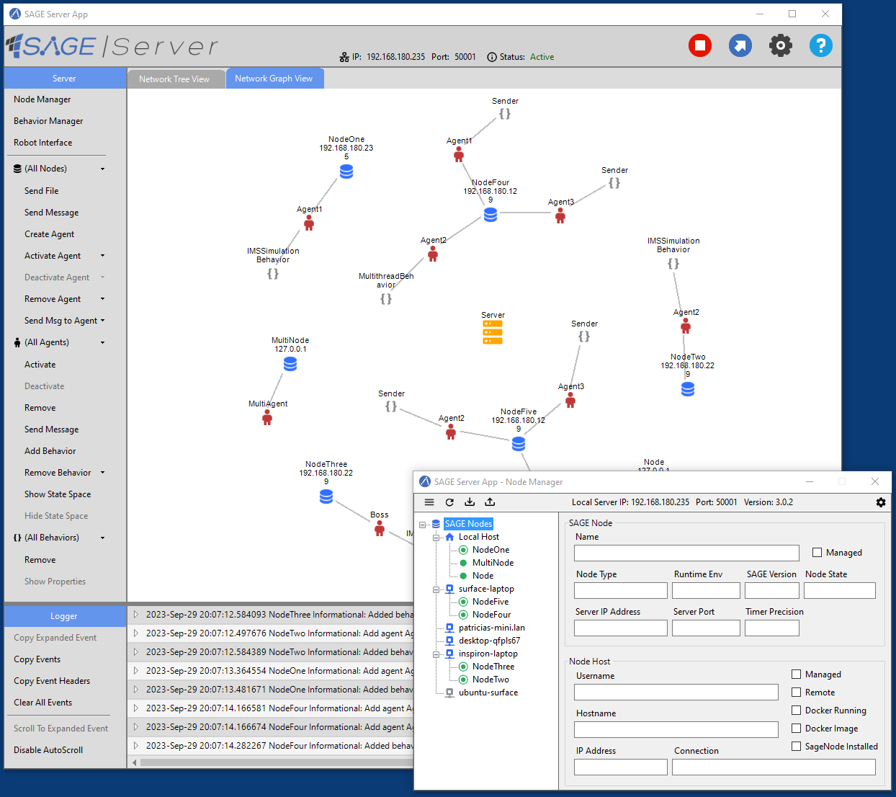

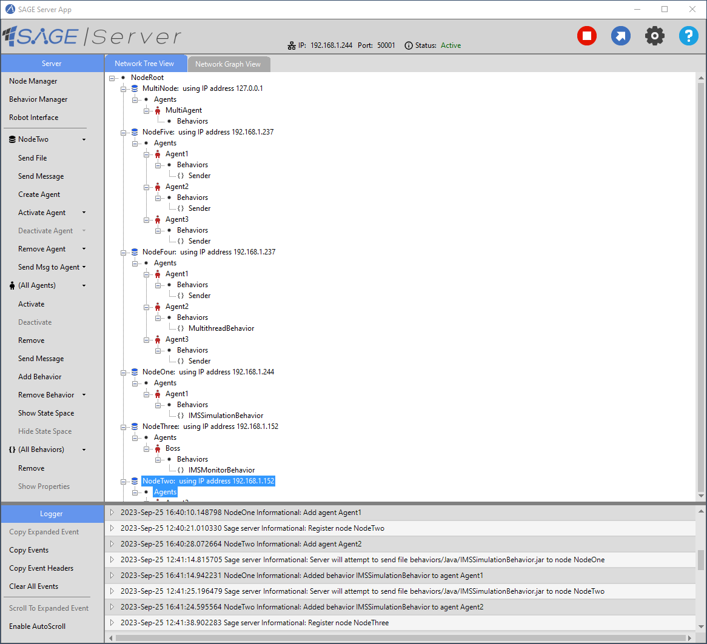
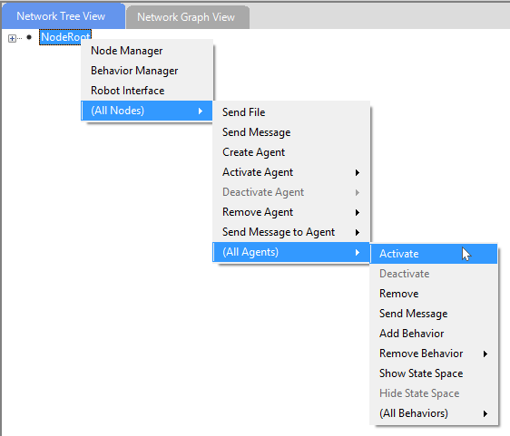
.. |image3| image:: _images/serverapp/image10.png
   :width: 3.09375in
   :height: 2.72168in
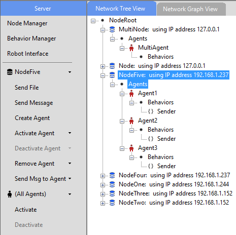
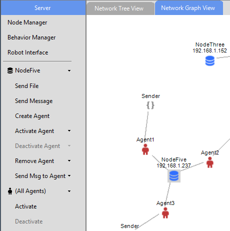
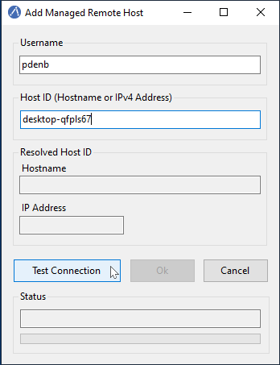
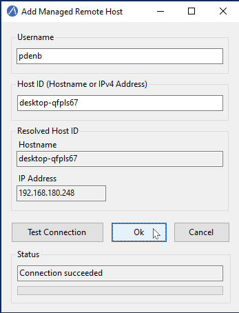
