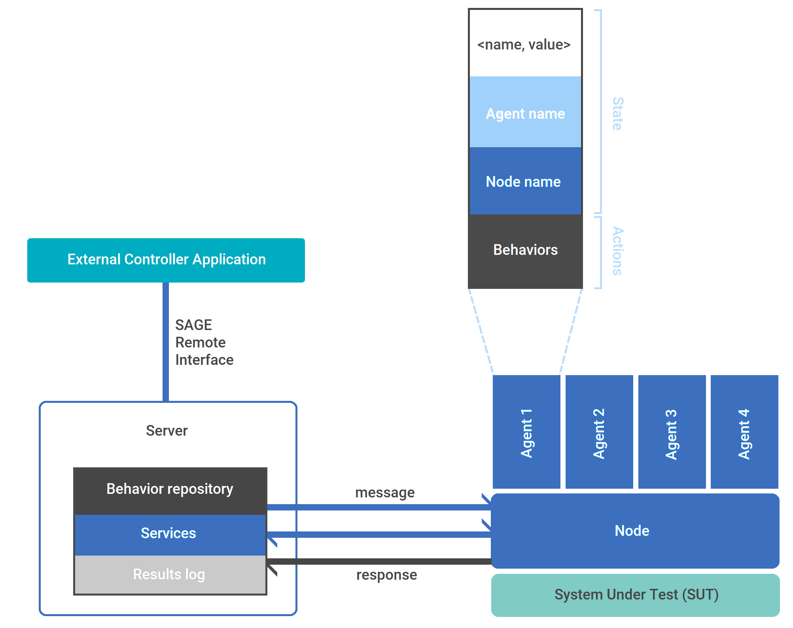

.. container:: header-banner-color

	.. container:: header-banner-text
	
		How It Works
		
How It Works
==========================

SAGE execution is summarized in these following steps:

1. `Starting a SAGE Server instance.`_
2. `Connecting SAGE Node instance to SAGE Server.`_
3. `Building an agent network.`_
4. `Distributing Behaviors to target Nodes.`_
5. `Activating agents.`_
6. `Creating a test case that runs a behavior.`_
7. `Logging the events, collecting the results.`_

   
   
An instance of a SAGE runtime consists of:

	- *ONE* instance of a SAGE Server
	- *ONE or MORE* SAGE Node instances running on either the Server computer or on remote computers with network connectivity to the Server Computer. 
	- In addition, a SAGE Node instance may have *MULTIPLE* SAGE Agents which may each have *MULTIPLE* Behaviors.

.. _`Starting a SAGE Server instance.`:

**1. Starting a SAGE Server instance**

To begin automating your environment, you must first stand-up a single SAGE Server instance.

The SAGE Server is the central component for your automation. It serves as a single-point of access for managing your Agent network, by handling communication and code (Behavior) distribution. 

.. _`Connecting SAGE Node instance to SAGE Server.`:

**2. Connecting SAGE Nodes**

The next step would be to stand-up your Node instances on all computers that are expected to execute any automation. This includes any local and remote machines.

Nodes act as a containers for your Agents. While your Agents execute your automation code, the Nodes can be viewed as conductors for Agents. This means that the Server has fewer components to communicate with as it bypasses the need to have to communicate with an Agent directly. 

This also means that as a user, you will not have to manually configure multiple Agents across multiple machines. Instead, you can stand up a single Node and later automate the creation and deletion of Agents tied to that Node.

This architecture was designed with scalability in mind.

.. _`Building an agent network.`:

**3. Adding agent entities to Nodes**

You can begin populating your Nodes with Agents as soon as your Nodes are initialized. This can be done via manual configuration or it can be automated by either coding it into Behaviors or through an external controller mechanism.

This gives you the possibility of dynamically building an agent network.

.. _`Distributing Behaviors to target Nodes.`:

**4. Managing Behaviors**

Behaviors are only sent to Agents on an as-needed basis. This minimizes overhead and gives Agents the flexibility of learning and unlearning skills on demand.

All Behaviors are stored in a single repository on the Server machine. When requested, the Behavior module will be sent from the Server to a remote Node. From there, the selected Agent will be granted access to the file.

This means that you will not have to worry about manually copying code across multiple machines during configuration.

.. _`Activating agents.`:

**5. Activating agents**

You are ready to activate your Agents once you have established connection between your Server and Nodes and have populated your Server with the necessary Behavior modules.

Agents must first be activated in order to receive any updates from the network. Thus, an agent that is not activated will not receive incoming messages.

Upon activation, your Agents may respond reactively or proactively depending on what Behaviors it contains and how those Behaviors are constructed.

Reactive execution occurs when an Agent perfroms some action upon receiving any incoming message.

Proactive execution can occur in multiple ways based on how an Agent's Behaviors are configured.

.. _`Creating a test case that runs a behavior.`:

**6. Running tests**

You can build out a step-by-step test case using the Robot Frameworks integration into SAGE Framework as a controller mechanism.

This integration allows you to send messages from the Controller. This message will propagate through the Server to the Node to instruct an Agent.

Upon receiving messages, your Agents will begin executing their coded automation abilities.

.. _`Logging the events, collecting the results.`:

**7. Capturing test results**

During automation, any pertinent information can be captured by Behaviors and reported as an execution result.

All information, including execution results as well as SAGE log events, are propagated back to the Server to be stored in a single location. This means you will not have to manually check multiple computers to verify your results.

Instead, users only have to check the logs residing on the Server machine.

