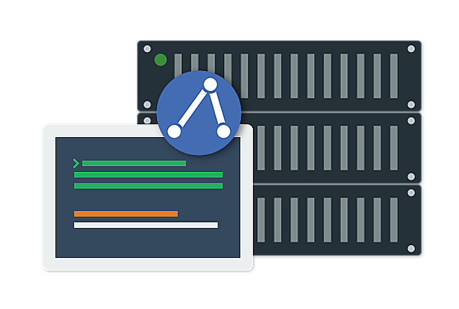

.. toctree::
   :hidden:
   :caption: Getting Started

   introduction
   features
   sage_server
   sage_node
   how_it_works
   Download <http://github.com/USNavalResearchLaboratory/sageframework/releases/>
   installation
   sage_app

.. toctree::
   :hidden:
   :caption: Building SAGE Network

   starting_a_server_instance
   connecting_a_node_to_the_server
   building_an_agent_network

.. toctree::
   :hidden:
   :caption: Creating Scripts

   writing_a_sage_behavior
   base_class_methods
   retrieving_information_about_your_agent_network
   sending_messages_between_agents
   responding_to_a_message_sent_to_an_agent

.. toctree::
   :hidden:
   :caption: Managing Scripts

   managing_behavior_files
   adding_a_behavior_to_an_agent
   using_supplemental_files_in_your_automation

.. toctree::
   :hidden:
   :caption: Starting Network

   activating_agents

.. toctree::
   :hidden:
   :caption: Running Tests

   robot_framework_background
   creating_a_test_case_using_robot_framework
   sage_robot_framework_keywords
   running_your_automation_test
   capturing_the_test_results
   creating_your_own_controller_application

.. toctree::
   :hidden:
   :caption: Demonstration

   example

.. toctree::
   :hidden:
   :caption: About

   changelog
   help
   contact_us
   
   

.. _my-reference-label:

.. container:: header-banner-title-color

	.. container:: header-banner-title-text
	
		SAGE (Sentry Agents) Framework
		
	.. container:: header-banner-title-caption
	
		A dynamic multi-agent based solution for system automation
		
	.. container:: header-banner-title-button
	
		`Download <http://github.com/USNavalResearchLaboratory/sageframework/releases/>`_
		
		Release |release|
	
.. container:: footer-banner-title-color
	
		Latest Documentation Update:		December 8, 2020
   
   

   
SAGE makes automating complex systems simple.
-------------------------------------------------------------------------------------------------------------------------

.. container:: three-caption
	
	.. figure::  _images/ic_clear_all_black_48dp_2x.png
		:align:   center
		
	Language Agnostic
	
	.. container:: three-text
	
		SAGE supports a wide range of popular programming languages including: C++, Java, and Python. No need to learn a new language to utilize SAGE.

.. container:: three-caption
	
	.. figure::  _images/ic_device_hub_black_48dp_2x.png
		:align:   center
		
	Open Integration
	
	.. container:: three-text
	
		SAGE permits language extensibility and enhancement so that you can easily integrate SAGE with other tools and applications. Built-in support is provided for Robot Framework.
		
.. container:: three-caption
	
	.. figure::  _images/ic_check_circle_black_48dp_2x.png
		:align:   center
		
	Easy to use
	
	.. container:: three-text
	
		SAGE is a cross-platform effort that was created with all users in mind. There is detailed documentation to support developers and testers alike.
