.. container:: header-banner-color

	.. container:: header-banner-text
	
		SAGE App

SAGE App
===============================

The SAGE App provides a graphical user interface for viewing and controlling the SAGE runtime environment. supports the following functions:

- Manage behavior modules
- Start and stop the SAGE server
- View connected nodes
- Create nodes on the local server machine
- Control node access to the server machine
- Send files and messages to nodes
- Create, activate, deactivate and remove agents
- Send messages to agents
- Add and remove agent behaviors
- Select, sequence and run SAGE Robot files
- View a generated Robot reports
- View SAGE server log output, including behavior execution results
- Import and Export SAGE networks

SAGE App is Windows compatible and distributed with the Windows x64 - Server installer. 

To run SAGE App, double-click on the shortcut icon, or right-click on the icon and select “Open” from the context menu.

Main window
+++++++++++++++++++++++++++++++++++++++++++++++++++++++
Following is an annotated view of the SageServerApp window when the application opens.

**Control Toolstrip**

Provides buttons for:

- Starting and stopping the SAGE Server.
- Importing and exporting a SAGE network.
- Configuring Server settings.
- Displaying information about the SAGE Server.

**Server Toolstrip**

Provides buttons for viewing and controlling the SAGE network:

- Create Nodes on the local Server machine.
- Create and remove Agents
- Activate and deactivate Agents.
- Add and remove Behaviors
- View Behavior properties.
- Send files to Nodes.
- Send messages to Nodes and Agents.
- Launch the SAGE Behavior Manager 
- Launch Robot Framwork Interface. 

**Network View Pane**

Allows you to view and control the SAGE network using the following views: 

- ``Network Tree View``
- ``Network Graph View``

Views can be toggled by clicking on the respective tabe.

**Logger Toolstrip** 

Allows you to interact with server-generated log events.

Provides buttons for :

- Copying event logs to the Windows clipboard
- Clearing logs displayed in the Logger View Pane.
- Controlling the scrolling of log events when the logger is active.

**Logger View Pane**

Allows you to view server-generated log events, including behavior execution results as they occur in real-time.

.. _serverAppSettings-label:

Server settings
+++++++++++++++++++++++++++++++++++++++++++++++++

Clicking on the ``Settings`` button in the "Control Toolstrip" brings up the Server Settings popup dialog. 

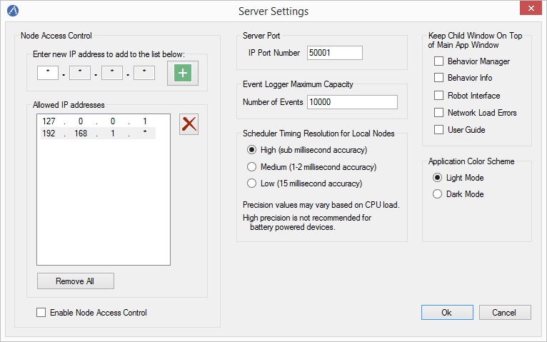

SAGE Server settings include the following:

- Control Node access to the server machine.
- Set Server IP port number
- Set the maximum capacity of the SAGE event logger.
- Set the scheduler timing resolution for local nodes.
- Adjusting window overlays.
- Changing color theme of application.

Settings are automatically saved when the application terminates.

**Server Port**

Set the port number that the SAGE Server is listening to.

**Node Access Control**

Node access control is enforced when ``Enable Node Access Control`` is checked. 

This allows you to whitelist IP addresses in dot-decimal notation. An asterisk may be used as a wildcard character for any of the octet-grouped decimal numbers. Only IP addresses listed are allowed to connect to the server.

**Event Logger Maximum Capacity**

Setting the maximum capacity of the event logger prevents Server-generated log events from overrunning memory when the Server runs for very long periods of time (day or even weeks). When the maximum capacity is reached, older events are removed to make room for new events. 

Network Tree View
+++++++++++++++++++++++++++++++++++++++++++++++++

The Network Tree View provides a tree view of the SAGE network.

- The root of the network tree is the Nodes tree-node representing the set of all connected SAGE Nodes.
- SAGE Nodes are shown as branches under the Nodes tree-node. Each Node has an Agents tree-node representing the set of all Agents belonging to the Node.
- A Node’s Agents are shown as branches under the Agents tree-node. Each Agent has a Behaviors tree-node representing the set of all Behaviors belonging to the Agent.
- An Agent’s Behaviors are shown as leaf tree-nodes under the Behaviors tree-node.

Clicking on any tree-node selects and highlights it. Tree-nodes representing ancestor network entities are also selected.

Right-clicking on a tree-node displays a set of cascading context menus with a set of commands relevant to the current selection. 

You can expand and collapse tree-nodes by clicking on the plus or minus sign next to a tree-node branch.

Double-clicking on a tree-node fully expands a branch if it is collapsed, and fully collapses a branch if it is expanded.
	

Network Graph View
+++++++++++++++++++++++++++++++++++++++++++++++++

The Network Graph View provides a dynamic graph display of the SAGE network.

- SAGE Nodes are shown as root graph-nodes of their own sub-graphs.
- Graph-nodes representing Agents are connected to their Node graph-node, and graph-nodes representing Behaviors are connected to their Agent graph-node.

Clicking on any graph-node selects and highlights it. Graph-nodes representing ancestor network entities are also selected.

Right-clicking on a graph-node displays a set of cascading context menus with a set of commands relevant to the selected object. 

Clicking on the Server graph-node or on the view background displays a context menu relevant to the entire network.

You can reposition entities within the graph region by dragging with the left mouse button.

Double-clicking on a graph-node centers the entity within the view pane.

Double-clicking on the view background centers the graph region about that position in the view pane.

The graph view can be panned by clicking down anywhere in the view pane that is not on a graph-node and dragging.

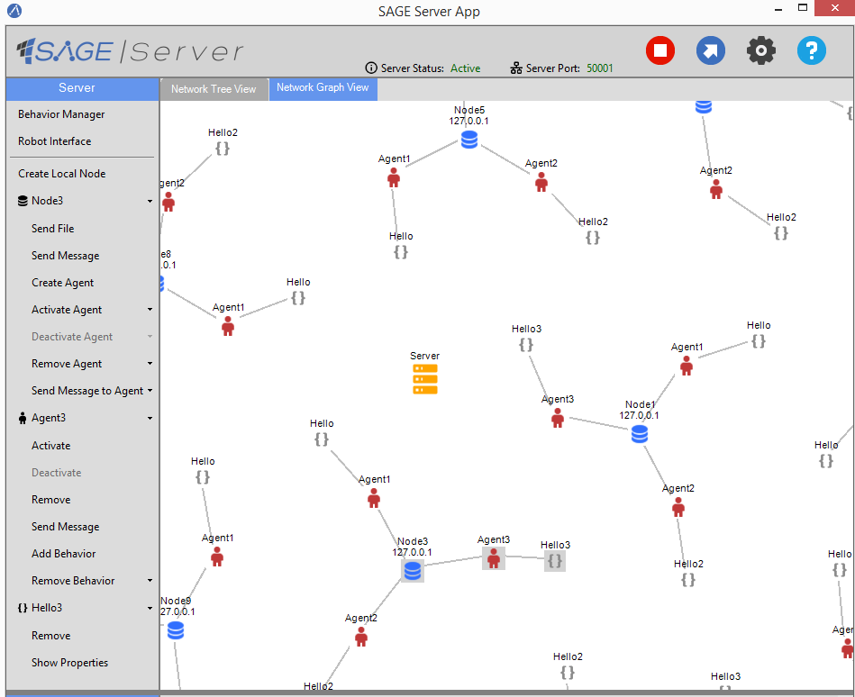

The graph view can be zoomed out and back in using the mouse wheel. When zooming, the scaling is applied about the mouse cursor position. 

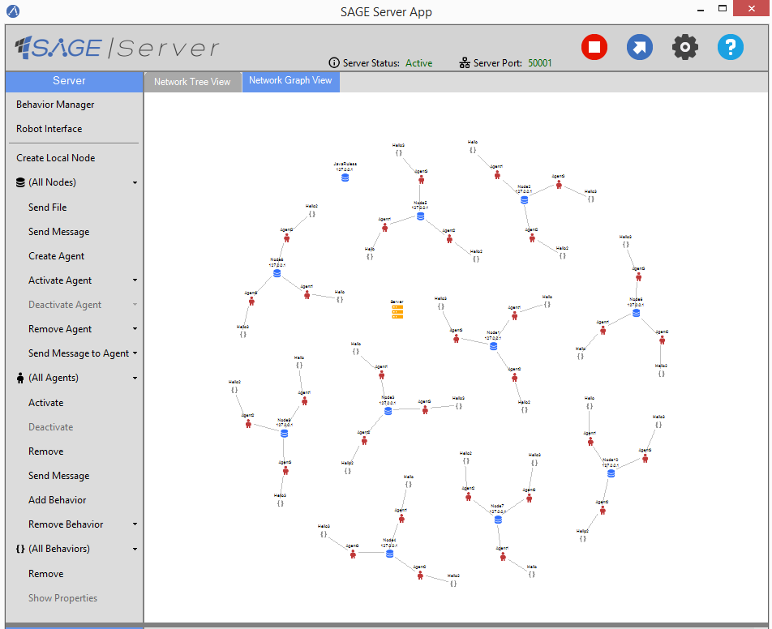

Starting the Server
+++++++++++++++++++++++++++++++++++++++++++++++++

Click the ``Start`` button or the ``Import Network`` button in the Control Toolstrip to start the Server instance.  After the Server has started, any previously created Nodes will be connected and displayed in the Network View Pane. 

If the Server is started using the ``Import Network`` button, a previously saved network is loaded. 

Once the Server becomes active, the ``Start`` button changes to a ``Stop`` button. The Server can be stopped at any time by clicking the ``Stop`` button.
	
Active Server
+++++++++++++++++++++++++++++++++++++++++++++++++

When the Server is active, the current state of the network is reflected in the Server Toolstrip and the Network View Pane. 

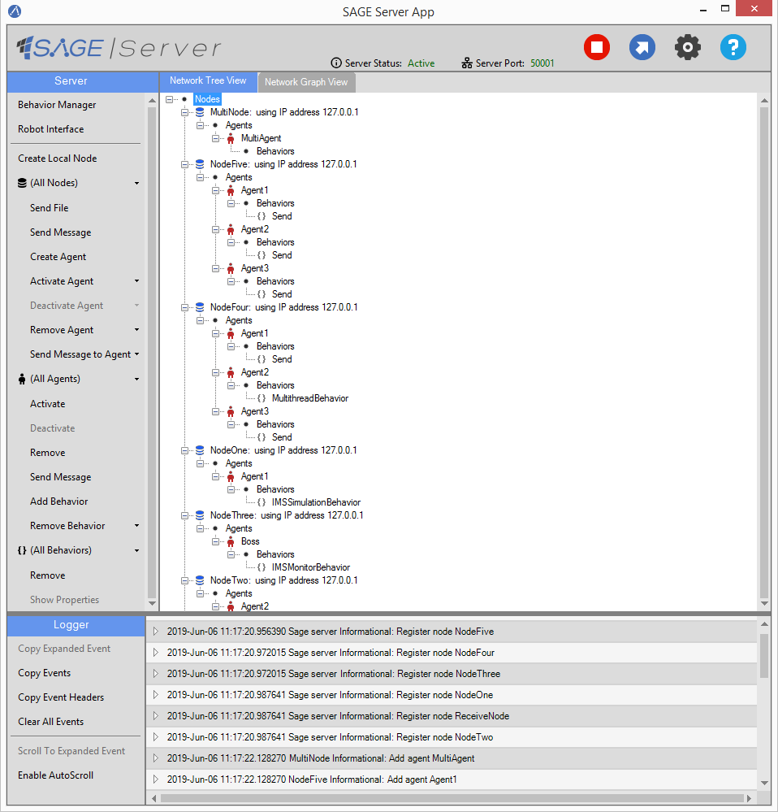
	
Clicking on the Network Graph View tab displays a graph-based view of the network.

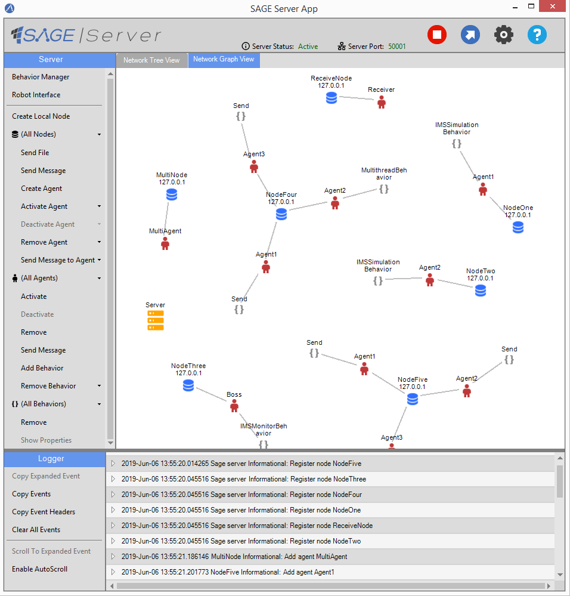

Nodes, their Agents and agent Behaviors are selected using either the ServerToolstrip or Network View Pane. 

Commands operate on the current selection and are accessible from either the Server Toolstrip or Network View Pane context menus.

On the Server Toolstrip: 

- node-related commands are under the ``Node`` dropdown button
- agent-related commands are under the ``Agent`` dropdown button
- behavior-related commands are under the ``Behavior`` dropdown button. 

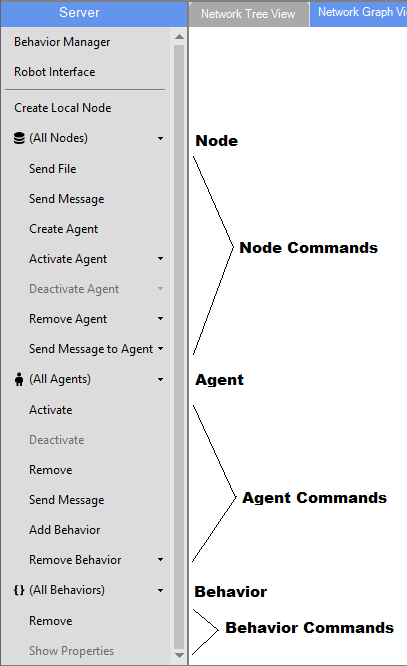

**Selecting a SAGE Node, Agent or Behavior** 

A SAGE object (Node, Agent or Behavior) can be selected from the Server Toolstrip or the Network View Pane.

To select a Node, Agent or Behavior from the Network View Pane, click on the corresponding tree-node or graph-node.

To select a Node, Agent or Behavior from the Server Toolstrip, click on the corresponding dropdown button and select the object’s name from the popup combo box, as shown below.

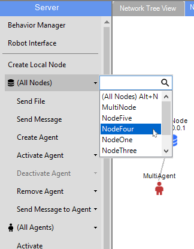

The current selection is reflected in both the Server Toolstrip and Network View Pane (tree view or graph view).

The mechanism for selecting SAGE objects and applying commands is enforced by the topology of the Network Tree and Graph Views and by the Server Toolstrip menu items.

You can quickly search for existing Agents and Nodes using the search menu located in the "Server Toolstrip"

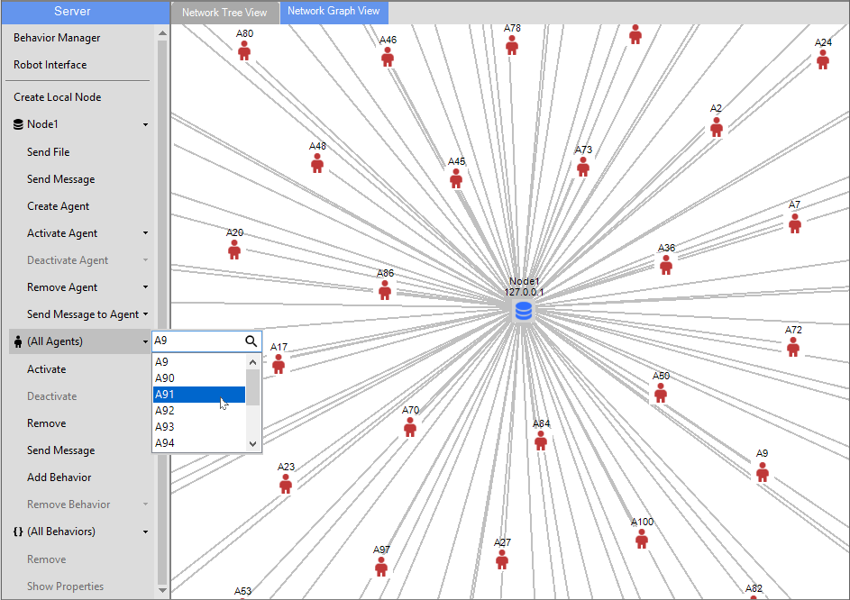

**Activating an Agent** 

Select a Node and Agent option from their respective dropdown list.

When an individual Node, Agent or Behavior is not selected, the corresponding dropdown button will display “(All Nodes)”, “(All Agents)”, or “(All Behaviors)”, and the commands will apply to all objects of that type.

Clicking the agent ``Activate`` button on the Server Toolstrip activates the agent and node option selected in the dropdown. 

To perform the same operation using the Network View Pane: 

1) In the Tree View right-click on the Nodes root-node, or in the Graph View right-click on either the Server graph-node or on the panel background.
2) Move the mouse over ``(All Nodes)`` to display the cascading node context menu.
3) Move the mouse over ``(All Agents)`` to display the cascading agent context menu.
4) Click the ``Activate`` button on the agent context menu.

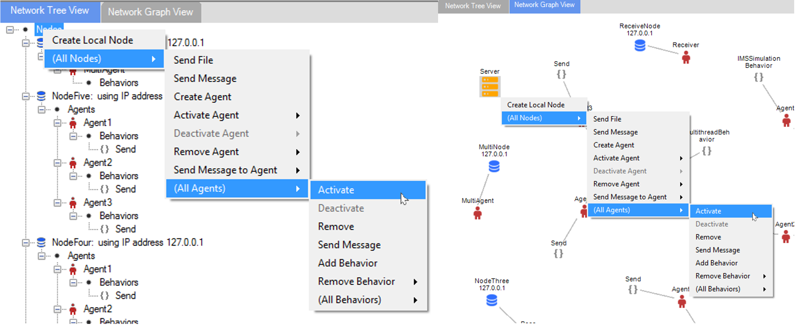

In the Network Graph View, icons representing the newly activated Agents change color from red (inactive) to green (active), and dynamic messaging lines show the flow of messages sent between Agents. 

Click on the Agent ``Deactivate`` button to deactivate the Agent and Node option selected.

Creating a Node on the Server machine
++++++++++++++++++++++++++++++++++++++++++++++++++++++++++++++++++++++++++++

A local (Server-based) Node can be created at any time, even when the Server is inactive, from the Server Toolstrip or Network View Pane (tree view or graph view). 

To create a local Node:

1) Click the ``Create Local Node`` button from either the Server Toolstrip or the Network View global context menu.
	- To display the global context menu on the Network Tree View, right-click on the Nodes  tree-node.
	- To display the global context menu on the Network Graph View, right click anywhere on the view pane background.
2) In the popup dialog, enter the Node’s name.
3) Click ``OK`` to confirm, or ``Cancel`` to cancel the operation.

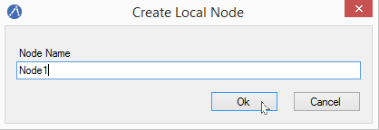

If the Server is inactive, there will be no visible evidence of the Node since the Node is not yet connected to the Server. A Node instance will connect once the Server is started.

Creating an Agent
+++++++++++++++++++++++++++++++++++++++++++++++++

To create an Agent on a SAGE Node:

1) Select a Node or All Nodes option, then click ``Create Agent`` from either the "Server Toolstrip" or the "Network View Pane" context menu. 
2) Enter the Agent’s name in the popup dialog.
3) Click ``OK`` to confirm, or ``Cancel`` to cancel the operation.

If an agent of that name already exists, an error message is displayed.

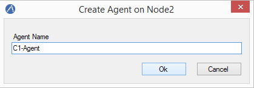

Behavior Manager
+++++++++++++++++++++++++++++++++++++++++++++++++++++++

Use the Behavior Manager to view and update installed Behaviors. 

Click the ``Behavior Manager`` button on the Server Toolstrip to open the Behavior Manager window.

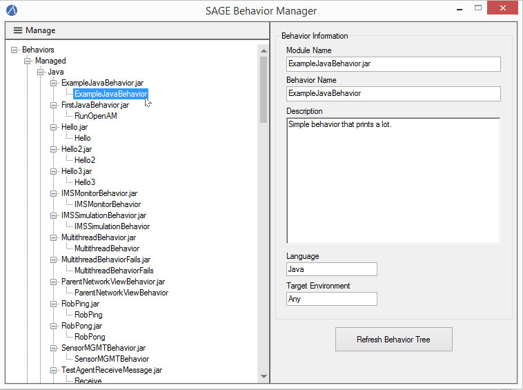

The left pane contains a tree view of the currently installed behavior modules and their Behaviors. 

The right pane contains information about a Behavior when its corresponding tree-node is selected. 

Tree-nodes at the first three levels represent hierarchical colletions of behavior module types, classified by language and target environment.

	- Under :mod:`Managed` are the currently supported managed types: "`Java`", "`JavaScript`" and "`Python`". 
	- Under :mod:`Native` are the currently supported native types: "`Linux32`", "`Linux64`", "`Windows32`" and "`Windows64`" (32-bit and 64-bit Windows and Linux modules).

Management capabilities include adding and deleting Behavior modules. 

To add or delete a Behavior from the repository:

1) Click the ``Manage`` button.
2) Select either the ``Add Modules`` or ``Delete Modules`` button.
3) Select the appropriate behavior files.

When a Behavior module is added or deleted, the module is automatically added to or removed from the proper Behavior repository sub-directory.

+--------------------------+-----------------------------------------------+
| Behavior Type            | Behavior Path                                 |
+==========================+===============================================+
| **Java**                 | C:\\ProgramData\\Sage\\behaviors\\Java        |
+--------------------------+-----------------------------------------------+
| **Javascript**           | C:\\ProgramData\\Sage\\behaviors\\JavaScript  |
+--------------------------+-----------------------------------------------+
| **Python**               | C:\\ProgramData\\Sage\\behaviors\\Python      |
+--------------------------+-----------------------------------------------+
| **Windows32**            | C:\\ProgramData\\Sage\\behaviors\\Windows32   |
+--------------------------+-----------------------------------------------+
| **Windows64**            | C:\\ProgramData\\Sage\\behaviors\\Windows64   |
+--------------------------+-----------------------------------------------+
| **Linux32**              | C:\\ProgramData\\Sage\\behaviors\\Linux32     |
+--------------------------+-----------------------------------------------+
| **Linux64**              | C:\\ProgramData\\Sage\\behaviors\\Linux64     |
+--------------------------+-----------------------------------------------+

Click the ``Refresh Behavior Tree`` button to synchronize the behavior tree with the Behavior repository when behaviors are installed or uninstalled from the repository outside of the app while the Behavior Manager window is open.

The Behavior Manager is available when the Server is both active and inactive and can remain open while the user interacts with the main form window.

Adding a Behavior to an Agent or Node
+++++++++++++++++++++++++++++++++++++++++++++++++

To add a Behavior to an Agent or Node:

1) Select a Node and Agent option from the Server Toolstrip or from the entity’s network view context menu.
2) Select the Behavior module from the list of available Behaviors.
3) Click ``Ok`` to confirm or ``Cancel`` to cancel the operation.

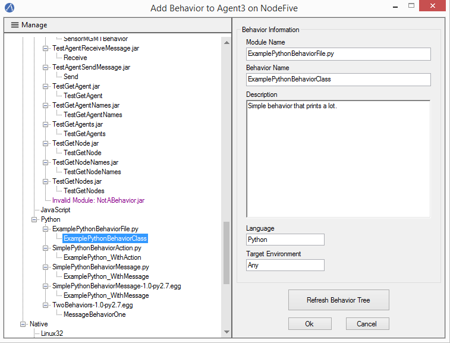

The following popup dialog will appear.

To specify topics for the Behavior:

1) Enter the desired behavior topic strings.  If topics have been added to a previous Behavior, button ``Paste Previous Topics`` will be enabled. This will automatically add the previous topics to this behavior.
2) Click ``Ok`` to continue or ``Cancel`` to continue without adding a topic.

Sending a message
+++++++++++++++++++++++++++++++++++++++++++++++++

The Send Message command allows the user to send a message from the SAGE server to one or more Nodes and their Agents. 

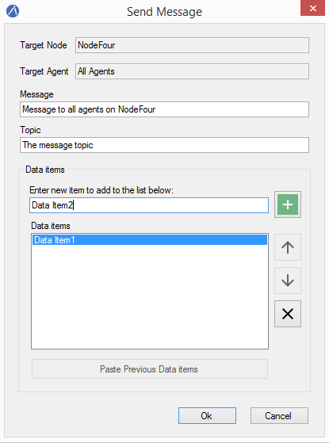

To construct and send a message:

1) Select Node and Agent option from the Server Toolstrip or from the entity’s network view context menu.
2) Click ``Send message`` button.
3) Enter the message text. 
4) Enter the topic of the message.
5) Enter any data items.
6) Click ``Ok`` to confirm or ``Cancel`` to cancel the operation.

Message sending is graphically depicted in the Network Graph View. Messages are shown traveling from the source (either the Server or an Agent) to one or more destination (SAGE Nodes and Agents). 

The source entity is highlighted with a large rectangle and the destination entity are highlighted with small rectangles. 

Server messages (generated using the Send Message command) are shown in orange.

Agent messages (generated by agent Behaviors) are shown in light blue.

Sending files to a Node
+++++++++++++++++++++++++++++++++++++++++++++++++

To send one or more files to a node:

1) Select the Node from the Server Toolstrip or Network View context menu.
2) Click ``Send File`` button.
3) Navigate to the desired folder and select the file or files to send.
4) Click ``Open`` to confirm, or ``Cancel`` to cancel the operation. 

A sub-folder with the same name as the Node will be created (if it does not already exist) in the SAGE data directory on the targeted Node machine where the sent files will be copied to.

.. code-block:: bat
	
	C:\\ProgramData\\SAGE\\data\\NodeName

Files will be sent to all Nodes if no Node is specified. 

.. _serverAppRobotInterface-label:

SAGE Robot Interface
+++++++++++++++++++++++++++++++++++++++++++++++++

The SAGE Robot Interface allows you to run Robot scripts and view the results from within the SAGE App. 

Click the ``Robot Interface`` button on the "Server Toolstrip" to start a new instance of the SAGE Robot Interface, as shown below.

At the top of the window are controls to select and sequence the Robot script files. 

Robot scripts are added, removed and sequenced using the buttons to the right of the Robot scripts list. 

The Add and Remove operations are also available from the **File** menu. 

To run a Robot script:

1) Open the Robot Interface
2) Click the ``Add`` button.
3) Select the Robot file and click ``Open``.
4) Repeat steps 1 and 2 to add additional Robot scripts.
5) Click the Start button  to start the run.

The Robot scripts will run one at a time in the sequence specified. 

Clicking the red ``Stop`` button will abort the run.

When a Robot script successfully completes, the pathname of the generated report file appears in the report list at the bottom of the window. 

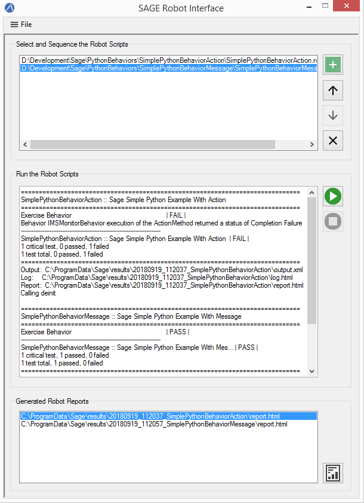

To view a report, select it from the report list and click the ``Report`` button located in the bottom-right corner. You may also right-click the report pathname and select ``View Report`` from the context menu.
	
Log viewer
+++++++++++++++++++++++++++++++++++++++++++++++++

The display of Server-generated log events are handled by the Log Viewer. 

The types of log events include exceptions, errors, warning, informational messages, and behavior execution results. 

By default a single-line header is displayed showing the timestamp, event type, and a brief description. 

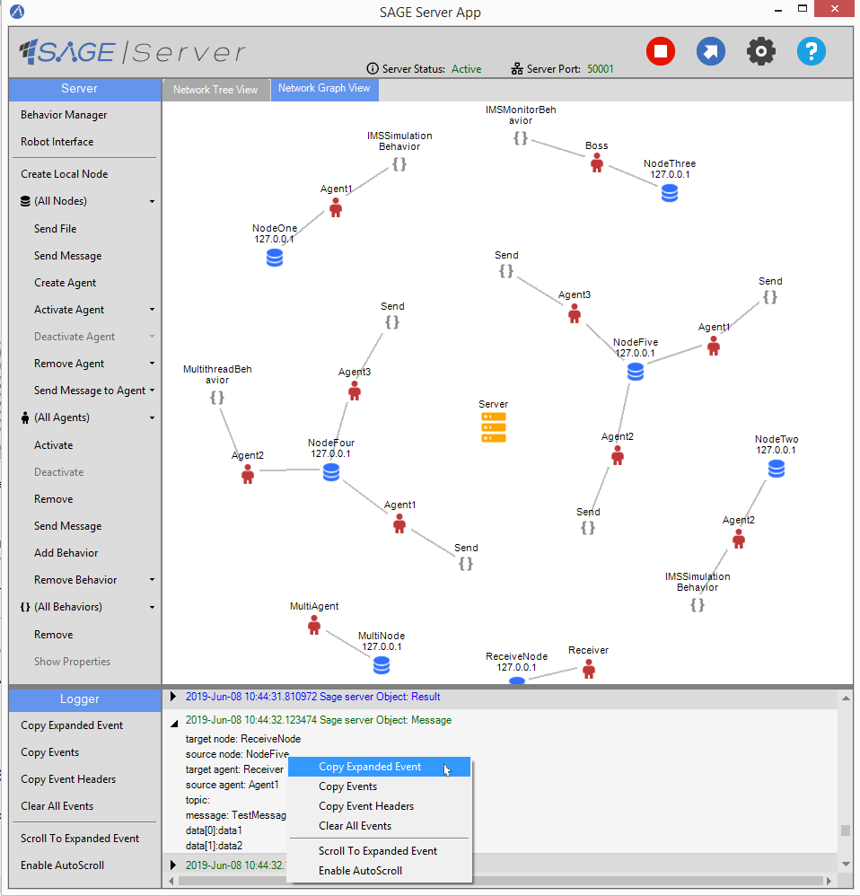

Message and result events can be expanded to show additional information. 

Only one log event can be expanded at a time.

The Logger Toolstrip provides buttons for copying log events to the Windows clipboard and for clearing the Log Viewer. These commands are also available on the context menu displayed when right-clicking on a log event.

When the Server is stopped, currently displayed event logs remain.

All events, including removed events, are saved to a log data file located in the log directory

.. code-block:: bat
	
	C:\\ProgramData\\SAGE\\logs

	
Import and export network
+++++++++++++++++++++++++++++++++++++++++++++++++

Agent network configurations can be saved and loaded. The files are saved as a JSON file with the extension ".sage".

**Export agent network**

The current network configuration can be exported (saved) when the Server is active.

To export an Agent network:

1) Click the ``Export Network`` button on the "Control Toolstrip".
2) Navigate to the desired folder
3) Enter a filename for your network configuration.
4) Click the ``Save`` button.

**Import agent network**

A previously saved network configuration can be imported (loaded) when the Server is inactive. 

To import an Agent network:

1) Click the ``Import Network`` button on the "Control Toolstrip".
2) Navigate to the folder containing the previously saved network file and select the file.
3) Click the ``Open`` button. 

Prior to building the network, SAGE will perform a validation check on the JSON tree by ensuring that all Nodes referenced in the network exist and that all Behaviors to be added to the Agents exists in the Behavior repository.

Any missing local Nodes will be automatically created. If any other errors remain, an “Agent Network Load Errors” dialog window will appear listing the errors. 

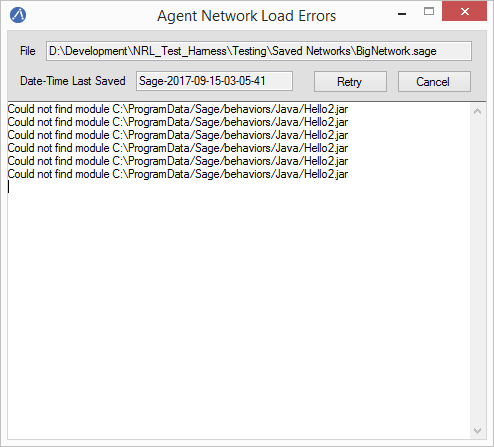

The dialog window remains open while the user attempts to resolve the issues.

Click the ``Retry`` button to retry loading the network configuration, or click ``Cancel`` to abort the operation.

If no errors persist, the Server is started and the saved network is fully configured.

